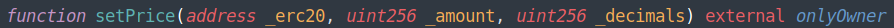
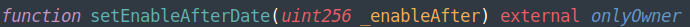

# Launchpad.sol

The Lunchpad contract allows wNFT to be sold with **Collateral** in the form of a specific ERC-20 token. wNFT in this case is the packaging of the ERC-20 token being sold. There may be other ERC-20 tokens in the Collateral of wNFT, but they do not affect the price of wNFT. Their balance for wNFT is not taken into account when calculating the price of wNFT.&#x20;

The mechanics of the calculation are as follows: an ERC-20 token being sold by wrapping some amount of it in wNFT can be sold for a native network token or ERC-20 tokens A, B, C (for example). Other ERC-20 tokens cannot be used to buy wNFT with Collateral. **Only the owner of the lunchpad contract sets the price per unit of ERC-20 token sold in the native token or ERC-20 tokens A, B,C**.&#x20;

When selling wNFT, the contract analyses how much ERC-20 token being sold is in Collateral, multiplies it by the price in native token or ERC-20 tokens A,B,C - depending on which token the buyer chooses to pay for the purchase. This calculates the price to sell wNFT with some amount of ERC-20 token to be sold.&#x20;

**The main feature of the contract is that it can only sell one kind of ERC-20 token in this way**. To sell another ERC-20 token, the contract must be re-deployed. Because when the contract is deployed, it is specified which ERC-20 token is being sold by the contract. And another ERC-20 token cannot be added to the contract settings for sale. When a contract is deployed into the network, the start date of the sale is fixed. It is not possible to buy wNFT with ERC-20 tokens in the collateral before this date.

### **Method claimNFT**

.png>)

The method allows the purchase of wNFT with collateral in the form of ERC-20 tokens sold. The method verifies that:&#x20;

* Sale launch has taken place&#x20;
* The token that the buyer wants to pay with is allowed for payment - the price in the token is set&#x20;
* If the user will pay with ERC-20 tokens, the user must not send the contract to the network's native tokens&#x20;
* If the user will pay with native network tokens, the balance of the native tokens must be greater than or equal to the price of wNFT. If an attempt is made to pay for wNFT more than the price, the user will be refunded change.&#x20;
* There is the allowance to use ERC-20 token for the purchase granted for the Launchpad contract

Once purchased, the buyer of wNFT with ERC-20 tokens for sale becomes the owner.  If the method is passed a null address in the payWith parameter, the method will assume that the purchase will be made in native network tokens.

**Parameters:**&#x20;

| Name        | Type    | Description                                                                                  |
| ----------- | ------- | -------------------------------------------------------------------------------------------- |
| **tokenId** | uint256 | Token id of the wNFT to be purchased                                                         |
| **payWith** | address | Address of the ERC-20 contract of the tokens the buyer wishes to use to pay for the purchase |

### Method **getWNFTPrice**

The method calculates the price of wNFT with ERC-20 tokens being sold for the tokens the buyer wishes to settle with. The price is calculated relative to the number of ERC-20 tokens contained in the wNFT collateral.

**Parameters:**

| Name        | Type    | Description                                                                                  |
| ----------- | ------- | -------------------------------------------------------------------------------------------- |
| **tokenId** | uint256 | Token id of the wNFT to be purchased                                                         |
| **payWith** | address | Address of the ERC-20 contract of the tokens the buyer wishes to use to pay for the purchase |

**Returns values:**

| Name          | Type        | Description                              |
| ------------- | ----------- | ---------------------------------------- |
| **payAmount** | **uint256** | Price wNFT in contract tokens at payWith |

### **Method withdrawEther**

<figure><figcaption></figcaption></figure>

The method transfers all native tokens from launchpad to msg.sender that there are on launchpad balance. Only the owner of the launchpad smart contract can call this method. The method does not have input parameters and output value.

### **Method** withdrawTokens

<figure><figcaption></figcaption></figure>

The method transfers all ERC-20 tokens from launchpad to msg.sender that there are on launchpad balance. The caller defines what tokens it needs withdraw. Only the owner of the launchpad smart contract can call this method. The method does not have output value.

**Parameters:**

| Name        | Type        | Description                                                        |
| ----------- | ----------- | ------------------------------------------------------------------ |
| **\_erc20** | **address** | The address of ERC-20 tokens smart contract that it needs withdraw |

### **Method** setPrice

<figure><figcaption></figcaption></figure>

The method sets price per unit of ERC-20 token being sold. Msg.sender defines by which tokens and how mutch buyer has to pay.  Only the owner of the launchpad smart contract can call this method. The method does not have output value.

**Parameters:**

<table><thead><tr><th width="177">Name</th><th width="116.33333333333331">Type</th><th>Description</th></tr></thead><tbody><tr><td><strong>_erc20</strong></td><td><strong>address</strong></td><td>The smart contract address of ERC-20 token by that buyers will be able pay your purchases  </td></tr><tr><td><strong>_amount</strong></td><td><strong>uint256</strong></td><td>The amount of ERC-20 tokens that buyers have to pay per unit ERC-20 token being sold</td></tr><tr><td><strong>_decimals</strong></td><td><strong>uint256</strong></td><td>The decimals places of the token</td></tr></tbody></table>

### **Method** setEnableAfterDate

<figure><figcaption></figcaption></figure>

The method sets  the start date of the sale. Only the owner of the launchpad smart contract can call this method. The method does not have output value.

**Parameters:**

<table><thead><tr><th width="157">Name</th><th width="127.33333333333331">Type</th><th>Description</th></tr></thead><tbody><tr><td><strong>_enableAfter</strong></td><td><strong>uint256</strong></td><td>The start date of the sale</td></tr></tbody></table>
