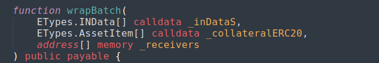

# Saft

## TrustedWrapperV2

This smart contract is special implementation  of WrapperBaseV1. It has more gas cheap  method to wrap NFTs that the users can use for wrap. This implementation does not have the blacklist of the collateral tokens and allows to create wNFTs with any ERC20, ERC721, ERC1155 tokens in the collateral.

### Method **wrap**

<figure><figcaption></figcaption></figure>

The method allows to create the wNFTs ERC721 or ERC1155 and save the information about wNFT and his collateral. Only trusted addresses can call this method. The owner of the smart contract can add the trusted addresses in a list. &#x20;

TrustedWrapperV2 contract inherits WrapperBaseV1 contract and all description how WrapperBaseV1  contract methods works can be found [here](https://docs.envelop.is/tech/smart-contracts/protocol/v1/contracts/wrapperv1).

The method creates a **WrappedV1** event specifying:

* the contract address of the original NFT;
* wNFT contract address;
* id of the original NFT;
* wNFT id;
* recipient wNFT;
* the number of native tokens that have been transferred as collateral for wNFT;
* description of wNFT rules.

The method creates a **CollateralAdded** event for every collateral record specifying:

* wNFT contract address;
* wNFT id;
* collateral asset type (from enum [ETypes.AssetType](https://docs.envelop.is/tech/smart-contracts/protocol/v1/contracts/wrapperv1#etypes.assettype));
* collateral contract address;
* collateral tokenId (for  NFT ERC721 and ERC1155 added in a collateral);
* number of NFT copies (for NFT ERC-1155 - balance,  for ERC20 tokens - the amount of the tokens, for NFT ERC721 - zero; added in a collateral).

The method returns a value with the following data structure:

* type of wNFT to be created (3 - ERC-721, 4 - ERC-1155, from  [ETypes.AssetType](https://docs.envelop.is/tech/smart-contracts/protocol/v1/contracts/wrapperv1#etypes.assettype))
* wNFT contract address
* wNFT id
* number of copies - wNFT balance (for ERC-1155 - value other than zero, for ERC-721 - 0)

The data types are described in contact LibEnvelopTypes.sol, [ETypes library](https://docs.envelop.is/tech/smart-contracts/protocol/v1/contracts/wrapperv1#etypes.assetitem).

**Input parameters of the method:**

<table><thead><tr><th width="148">Name</th><th width="182">Type</th><th>Description</th></tr></thead><tbody><tr><td><strong>_inData</strong></td><td><strong>ETypes.INData</strong></td><td>Data for creating wNFT. The description of the data type is <a href="https://docs.envelop.is/tech/smart-contracts/protocol/v1/contracts/wrapperv1#etypes.indata">here</a>.</td></tr><tr><td><strong>_collateral</strong></td><td><strong>ETypes.AssetItem[]</strong></td><td>Transferable collateral data for wNFT - as an array. The description of the data type is <a href="https://docs.envelop.is/tech/smart-contracts/protocol/v1/contracts/wrapperv1#etypes.assetitem">here</a>.</td></tr><tr><td><strong>_wrappFor</strong></td><td><strong>address</strong></td><td>Address for which wNFT is created</td></tr></tbody></table>

### Method transferIn

<figure><figcaption></figcaption></figure>

This method transfers the assets (ether, ERC20, ERC721, ERC1155 tokens) to **TrustedWrapperV2** smart contract address. Only trusted addresses can call this method.

Only the owner of the assets or a spender can transfer the assets by this method. To do so, the asset owner FT must set allowance for the **TrustedWrapperV2** contract to use it.

The method returns a value with the following data structure:

* the amount of the asset that was transferred.

**Input parameters of the method:**

<table><thead><tr><th>Name</th><th width="198">Type</th><th>Description</th></tr></thead><tbody><tr><td><strong>_assetItem</strong></td><td>ETypes.AssetItem</td><td>Transferable asset data. The description of the data type is <a href="https://docs.envelop.is/tech/smart-contracts/protocol/v1/contracts/wrapperv1#etypes.assetitem">here</a>.</td></tr><tr><td><strong>_from</strong></td><td>address</td><td>Address who assets will be transferred to  <strong>TrustedWrapperV2</strong> address</td></tr></tbody></table>

## BatchWorker

This smart contract allows to wrap wNFTs batch or add a collateral in wNFTs batch per one transaction.&#x20;

### **Method wrapBatch**

<figure><figcaption></figcaption></figure>

The method allows to create the wNFTs ERC721 or ERC1155 batch and add a collateral at the same time per one transaction. The users can use any collateral tokens (ERC20, native), there are not any restriction for the adding tokens.&#x20;

For the adding native tokens in the collateral the users must have the record about it in collateral array passed the method. The users must set in this record  the amount of native tokens for one wNFT. The method is payable. The smart contract checks the amount of attached to the transaction of the native tokens is enougth for the adding according to the collateral array record. The attached to the transaction msg.value of the native tokens is divided equally between all creating wNFTs. Don't forget add the record about native tokens with the amount for one wNFT in the collateral array .

The users must set the allowance for **TrustedWrapperV2** smart contract address to use their ERC20 tokens if they want to add it in the collateral of wNFTs. For ERC20 tokens the amount for the allowance calculates like the wNFT count multiplaying to the amount from the collateral array record  of this ERC20 token passed to the method. The users must set the amount of the tokens in the collateral array record necessarily which they want to add in one wNFT.

For the wrapping ERC721 or ERC1155 tokens the users must set the allowance for **TrustedWrapperV2** smart contract address to use them also.

The method creates a **WrappedV1** event for every creating wNFT specifying:

* the contract address of the original NFT;
* wNFT contract address;
* id of the original NFT;
* wNFT id;
* recipient wNFT;
* the number of native tokens that have been transferred as collateral for wNFT;
* description of wNFT rules.

The method creates a **CollateralAdded** event for every collateral record and for every creating wNFT specifying:

* wNFT contract address;
* wNFT id;
* collateral asset type (from enum [ETypes.AssetType](https://docs.envelop.is/tech/smart-contracts/protocol/v1/contracts/wrapperv1#etypes.assettype));
* collateral contract address;
* collateral tokenId (for  NFT ERC721 and ERC1155 added in a collateral);
* number of NFT copies (for NFT ERC-1155 - balance,  for ERC20 tokens - the amount of the tokens, for NFT ERC721 - zero; added in a collateral).

**Input parameters of the method:**

| Name                  | Type                    | Description                                                                                                                                                                                                     |
| --------------------- | ----------------------- | --------------------------------------------------------------------------------------------------------------------------------------------------------------------------------------------------------------- |
| **\_inDataS**         | **ETypes.INData\[]**    | Data for creating wNFT -  as an array. The description of the data type is [here](https://docs.envelop.is/tech/smart-contracts/protocol/v1/contracts/wrapperv1#etypes.indata).                                  |
| **\_collateralERC20** | **ETypes.AssetItem\[]** | The asset data adding in the collateral for every wNFT- as an array. The description of the data type is [here](https://docs.envelop.is/tech/smart-contracts/protocol/v1/contracts/wrapperv1#etypes.assetitem). |
| **\_receivers**       | **address\[]**          | Address for which wNFT is created - as an array.                                                                                                                                                                |

### **Method** addCollateralBatch

This method gives the opportunity to add ERC20 or the native tokens in the collateral of wNFT tokens batch per one transaction. The users can add only tokens added in the whitelist in the collateral. Only the owner of **TrustedWrapperV2** smart contract has the permitions to add the tokens in the whitelist.

The method is payable. For the adding native tokens in the collateral the users must attach the ether amount to a transaction. This amount will be divided equally between all wNFT tokens who token ids are passed to the method.

The users must set the allowance for **BatchWorker** smart contract address to use their ERC20 tokens if they want to add them in the collateral of wNFTs. For ERC20 tokens the amount for the allowance calculates like the wNFT count multiplaying to the amount from the collateral array record of this ERC20 token passed to the method.  The users must set the amount of the tokens in the collateral array record necessarily which they want to add in one wNFT.

The method creates a **CollateralAdded** event for every collateral record and for every wNFT specifying:

* wNFT contract address;
* wNFT id;
* collateral asset type (from enum [ETypes.AssetType](https://docs.envelop.is/tech/smart-contracts/protocol/v1/contracts/wrapperv1#etypes.assettype));
* collateral contract address;
* collateral tokenId (for  NFT ERC721 and ERC1155 added in a collateral);
* number of NFT copies (for NFT ERC-1155 - balance,  for ERC20 tokens - the amount of the tokens, for NFT ERC721 - zero; added in a collateral).

**Input parameters of the method:**

| Name                  | Type                | Description                                                                                                                                                                                                     |
| --------------------- | ------------------- | --------------------------------------------------------------------------------------------------------------------------------------------------------------------------------------------------------------- |
| **\_wNFTAddress**     | address\[]          | Array of the smart contract addresses of wNFT tokens which were wrapped by **BatchWorker.**                                                                                                                     |
| **\_wNFTTokenId**     | uint256\[]          | Array of ids of wNFT tokens which were wrapped by **BatchWorker.**                                                                                                                                              |
| **\_collateralERC20** | ETypes.AssetItem\[] | The asset data adding in the collateral for every wNFT- as an array. The description of the data type is [here](https://docs.envelop.is/tech/smart-contracts/protocol/v1/contracts/wrapperv1#etypes.assetitem). |

