# Instruction

Cross-NFT is **a crosschain assets exchange tool** for asset owners in different networks. If you need to exchange, for example, USDT in Polygon network to DAI in Ethereum network, you have come to the right place.

Currently, exchanges are possible between Ethereum, Polygon, BSC networks.

Requirements:&#x20;

* To have wNFT in the Polygon network with USDT in Collateral
* To have an exchange partner with DAI in Ethereum network

On the selected wNFT in the application [https://appv1.envelop.is/list](https://appv1.envelop.is/list), you need to click on "**breadcrumbs**" and select "Prepare for crossing":

<figure>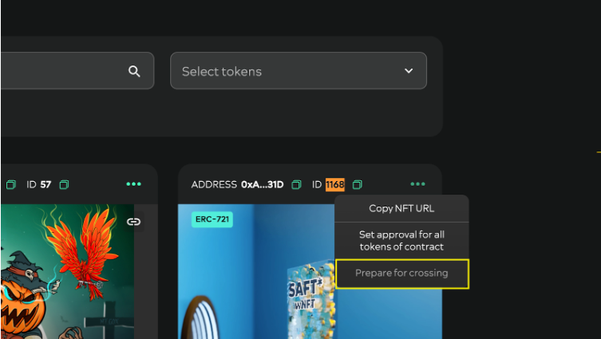<figcaption></figcaption></figure>

This will bring you to the Cross-NFT **preparation** window:

<figure>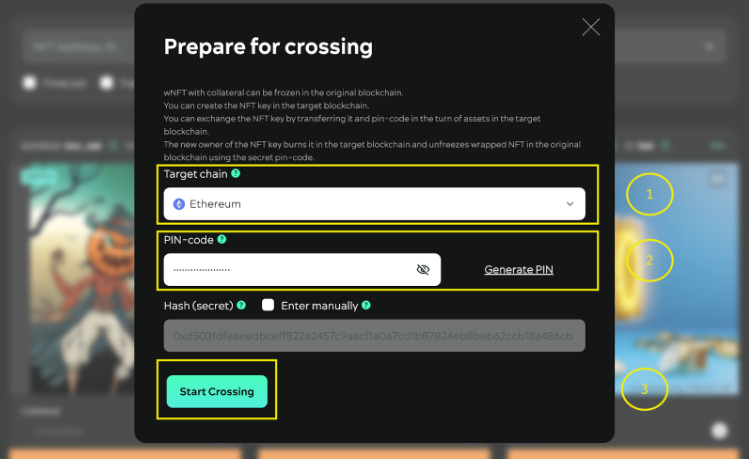<figcaption></figcaption></figure>

Here you need to **enter** (from top to bottom):

1. The network in which the cross-transaction will take place (Ethereum in our case);
2. Pin-code (better to generate, but you can also enter it manually);
3. After that you need to click "Start Crossing".&#x20;

Next you will be taken to MetaMask to confirm the transaction (don't forget the gas):&#x20;

<figure><figcaption></figcaption></figure>

During confirmation, you may see a similar **window** (and more than once: it depends on the settings you chose earlier):

<figure><figcaption></figcaption></figure>

There can be **several** confirmations in MetaMask:

<figure>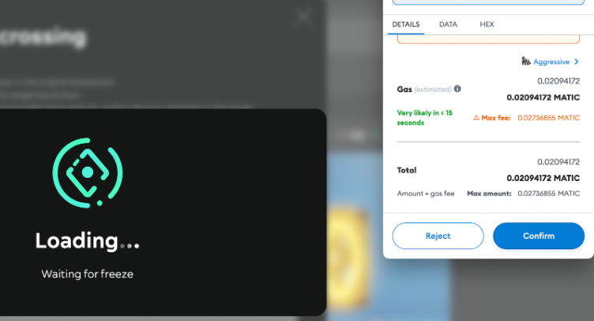<figcaption></figcaption></figure>

After these manipulations you will be taken to a window with a pin-code and a **proof** to it (this is a proof of the **correlation** of the key to a specific set of crosschain parameters):

<figure>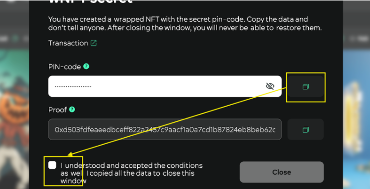<figcaption></figcaption></figure>

**ATTENTION**! Be sure to first copy and check the key you entered before checking the "I understood..." box.&#x20;

The smart-contract does not store the pin-code in the blockchain. Only the hash of the pin-code (value in the “**Proof field**”).

**Next**, the following table will appear on the page [https://appv1.envelop.is/crossings](https://appv1.envelop.is/crossings):

<figure>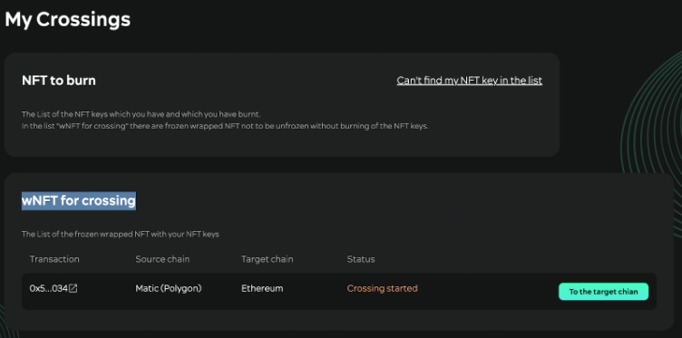<figcaption></figcaption></figure>

Click (press) “To the target chain” button

<figure>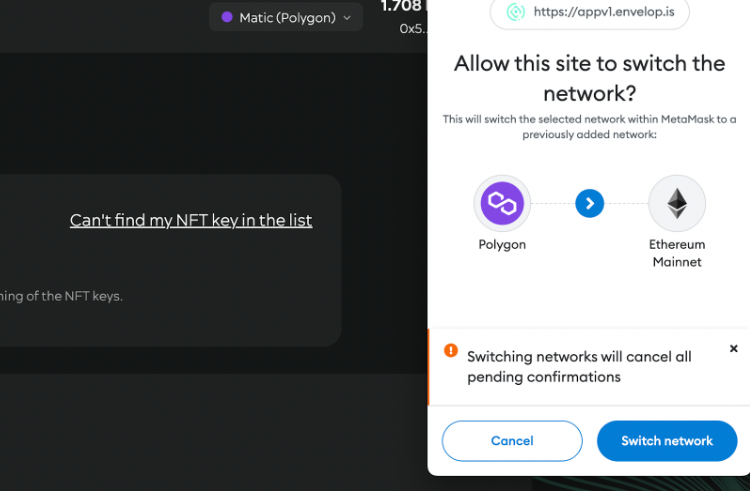<figcaption></figcaption></figure>

MetaMask will then ask us to **change** the network. This will take you to the same page [https://appv1.envelop.is/crossings](https://appv1.envelop.is/crossings), but on a different network, where you will see the following:

<figure>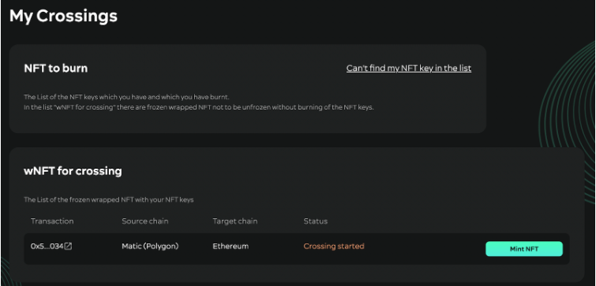<figcaption></figcaption></figure>

Here you will need to click (press) the "Mint NFT" button. MetaMask will then ask you to confirm the transaction again:

<figure>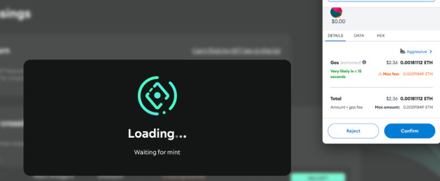<figcaption></figcaption></figure>

And then you will have an NFT-key created

<figure>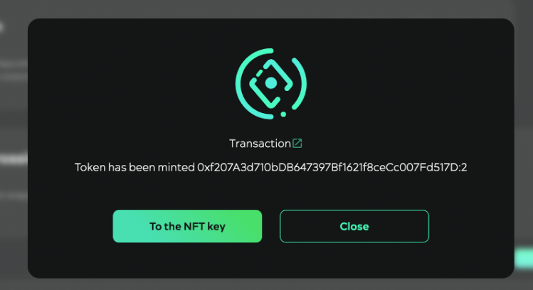<figcaption></figcaption></figure>

Click on "To the NFT key" button and you will be taken to the NFT-key page:\

<figure>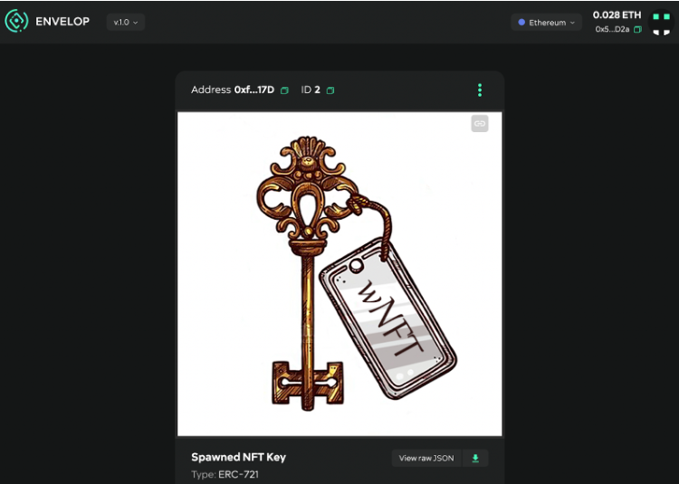<figcaption></figcaption></figure>

Next, click on the "breadcrumbs" on the key (top right corner of the **displayed** NFT):&#x20;

<figure>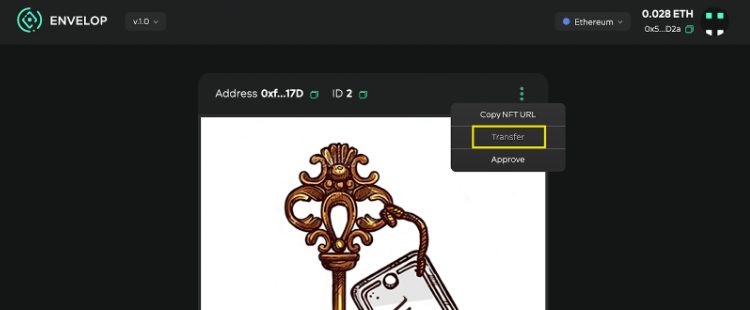<figcaption></figcaption></figure>

And click on the "**Transfer**" button, indicating the recipient:&#x20;

<figure>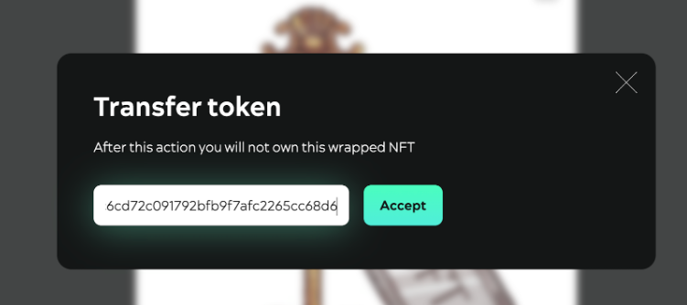<figcaption></figcaption></figure>

You have to enter address of recipient and click on the single "Accept" button. Then confirm the transaction in MetaMask:\

<figure><figcaption></figcaption></figure>

Your key will be transferred to the new owner.&#x20;

**Disclaimer**! The exchange process starts as soon as you tell your **swap** partner your pin-code or transfer your NFT-key to him. At the moment the NFT-key and pin-code exchange process is not automated. In the next version this step will be automated. So please choose reliable, trustworthy partners for the exchange. **DAO Envelop is not responsible for the actions of exchange participants**.&#x20;

<figure>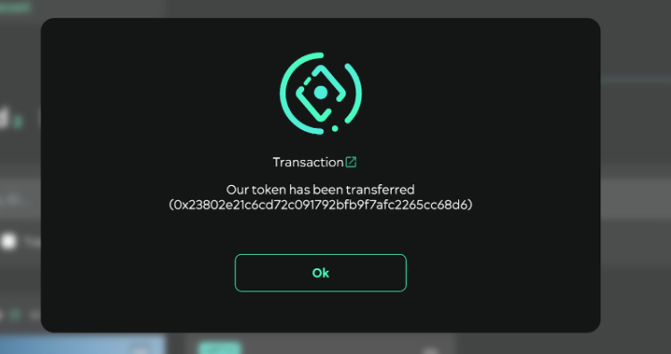<figcaption></figcaption></figure>

Tell the new owner the pin-code. And get the assets from him on the Ethereum network

The new owner then needs to be on the Ethereum network and do NFT- key burning via the same page [https://appv1.envelop.is/crossings](https://appv1.envelop.is/crossings):\

<figure>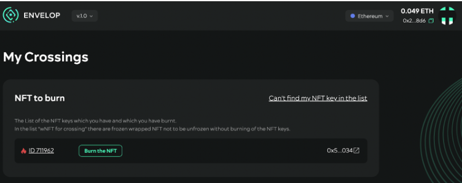<figcaption></figcaption></figure>

To do this, he clicks on "Burn the NFT" button and **confirms** in the window that appears:

<figure><figcaption></figcaption></figure>

Confirms it in MetaMask:\

<figure>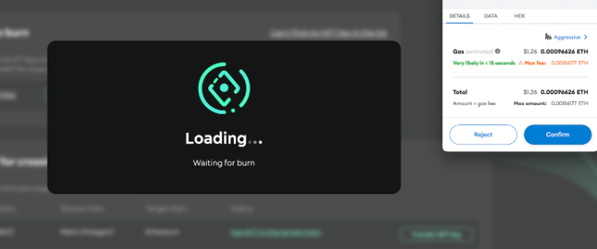<figcaption></figcaption></figure>

If necessary, it waits a bit:

<figure>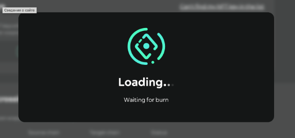<figcaption></figcaption></figure>

The transaction will then be completed

<figure>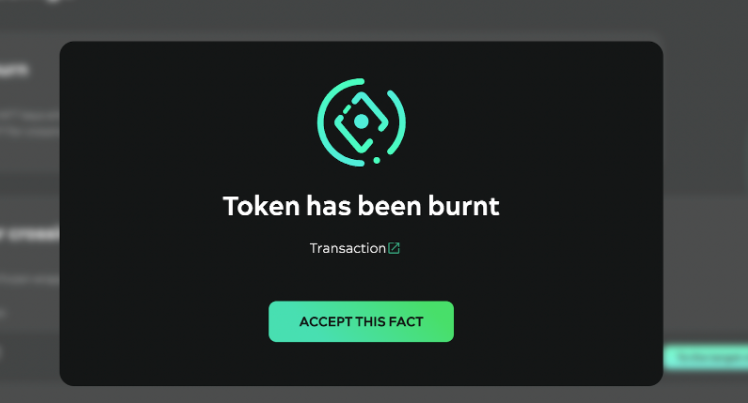<figcaption></figcaption></figure>

The new owner needs to switch to the Polygon network in MetaMask

\
Next, the following table will appear on the page [https://appv1.envelop.is/crossings](https://appv1.envelop.is/crossings):

<figure>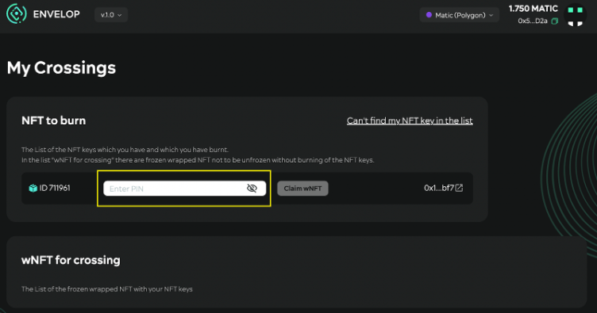<figcaption></figcaption></figure>

Where you will need to enter the pin code you received earlier. Only then will the "Claim wNFT" button be active:&#x20;

<figure>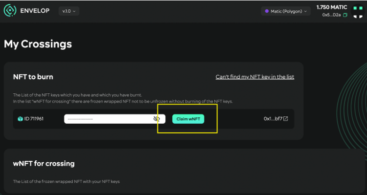<figcaption></figcaption></figure>

The new owner will need to **reconfirm** the transaction in MetaMask:\

<figure>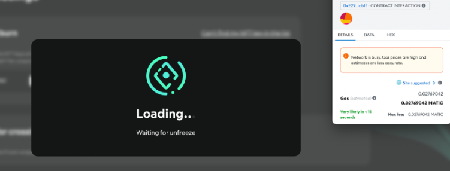<figcaption></figcaption></figure>

The transaction will be completed successfully

<figure>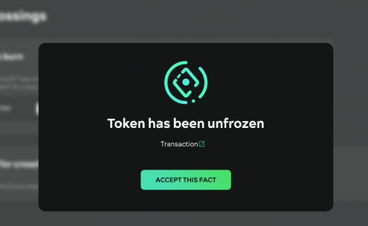<figcaption></figcaption></figure>

The exchange is now complete. The new owner has received wNFT with Polygon network tokens. He can then unwrap wNFT and receive Polygon network tokens
