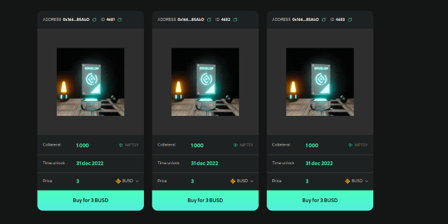
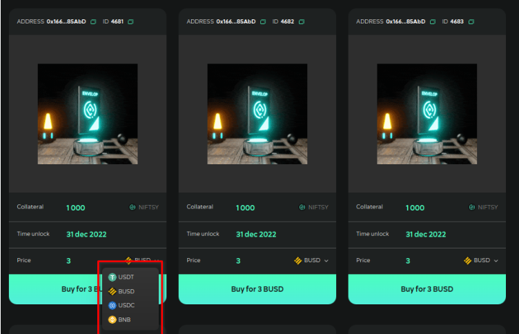
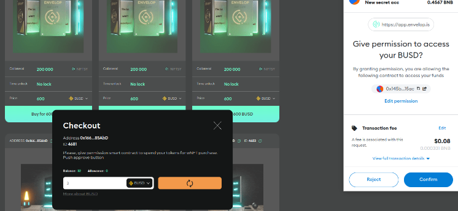
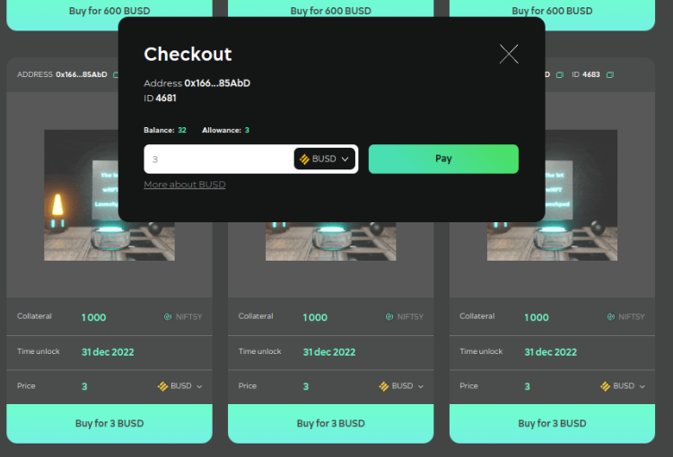
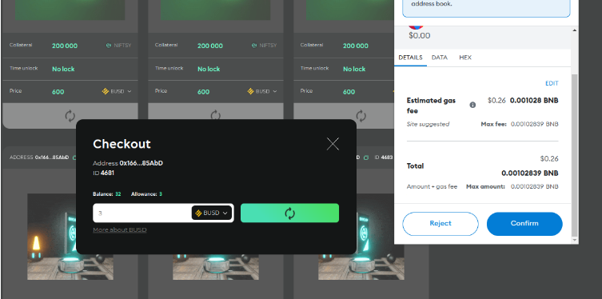
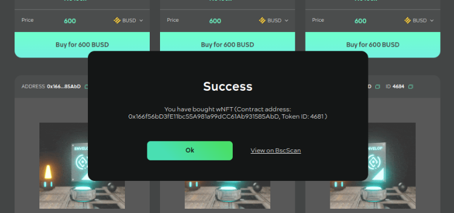

# Instruction

### Administration

Launchpad is used to distribute ERC-20 tokens of projects. ERC-20 tokens are placed in the wNFT version №0 (v.0) of the Envelop Protocol as Collateral. And they are being transferred to the smart-contract address of the Launchpad. You can create a wNFT here ([https://app.envelop.is/#/](https://app.envelop.is/#/)) or here ([https://app.envelop.is/#/saft](https://app.envelop.is/#/saft)).&#x20;

For each ERC-20 token, a different smart-contract is deployed for the Launchpad. And prices are set in native (coins) and ERC-20 tokens per unit of token sold. The price of wNFT with Collateral in ERC-20 tokens sold is defined as the price per unit multiplied by the number of tokens sold in the wNFT Collateral.

A separate web application is deployed for purchasers of the project tokens, to which the deployed launchpad smart-contract is connected. Deployment of the web application and the smart-contract customization can be done by the DAO Envelop support team or technical team of the project, which purchased the Launchpad from DAO Envelop. For purchasing and setup questions, please e-mail:[ info@envelop.is](mailto:info@envelop.is).

See documentation  [https://docs.envelop.is/tech/smart-contracts/v0/contract-launchpad.sol](https://docs.envelop.is/tech/smart-contracts/v0/contract-launchpad.sol) to learn how the smart contract of the Launchpad works.

### User manual

A launchpad with NIFTSY DAO Envelop tokens for sale can be found at [https://app.envelop.is/launchpad/#/](https://app.envelop.is/launchpad/#/) on the Binance Smart Chain (BSC) network.

On the launchpad, wNFTs are displayed as cards with the number of ERC-20 tokens they contain and their prices.

<figure><figcaption></figcaption></figure>

User selects tokens from a list with which they want to pay wNFT:&#x20;

<figure><figcaption></figcaption></figure>

Presses the "**Buy**" button:

<figure><figcaption></figcaption></figure>

Gives permission to use their ERC-20 tokens to the launchpad smart contract by confirming the transaction on the pop-up that opens. It is necessary for the smart contract to be able to **withhold** payment when purchasing **wNFT**.

Confirms the transaction in MetaMask:

<figure><figcaption></figcaption></figure>

Then press Buy on the wNFT card again. And confirm the payment transaction with "Pay".&#x20;

<figure><figcaption></figcaption></figure>

Confirms the transaction in MetaMask.\

<figure><figcaption></figcaption></figure>

The app informs you that the user has **purchased** wNFT.

<figure><figcaption></figcaption></figure>

Further wNFT can be found on the dashboard in the Wrapper app:&#x20;

[https://app.envelop.is/](https://app.envelop.is/)  &#x20;

After the time-lock date, wNFT can be unwrapped and NIFTSY tokens can be added to your balance.

\
