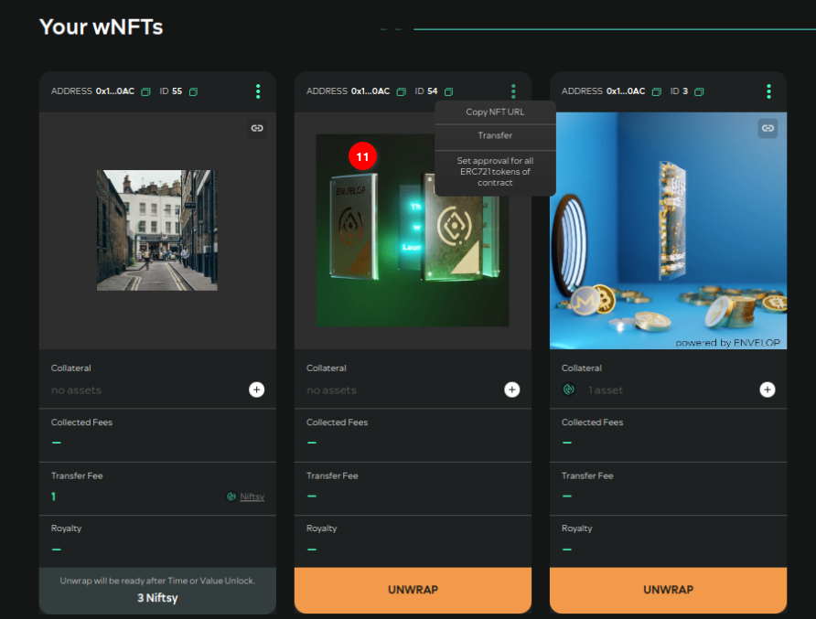

# Aptos instruction

The dAPP works with Petra wallet browser extention. The testing was providing in desktop Chrome browser.

The link of dAPP is [https://aptos.envelop.is/dashboard](https://aptos.envelop.is/dashboard). Open it. We will be on the dashboard.&#x20;

To begin to work in dAPP we should connect Petra wallet to it. Press Connect wallet.

After that the dashboard shows all Digital assets (DA). The Envelop oracle provides the dashboard the data about it.

<figure><figcaption></figcaption></figure>

<figure><figcaption></figcaption></figure>

Here there are the Digital assets (DA), the wrapped DA, the collateral information about all user's wrapped DAs.&#x20;

### How to wrap DA?&#x20;

**Step №01**. To create wrapped DA we need press the Free wrap button or press Wrap button on the DA of the DA dashboard tab.&#x20;

In the first case the dAPP will wrap the default DA that the dAPP will create before the wrapping (with the default metadate).

In the second case the dAPP will wrap the user's DA and after that the user's DA will store in the wrapped DA.

In the first case

<figure><figcaption></figcaption></figure>

In the second case

<figure><figcaption></figcaption></figure>

We can change the DA address in the form.

**Step №02**. If we want to add Сollateral in the form of (native) network tokens when wrapping in wrapped DA, we should specify the number of tokens.

**Step №03**. If we want wrapped DA to be unlocked for some time, we should specify the number of days in the "Time Unlock" field.&#x20;

<figure><figcaption></figcaption></figure>

**Step №04.** After entering the data, press "Wrap" button.&#x20;

**Step №05.** Confirm the transaction in Petra wallet.&#x20;

<figure><figcaption></figcaption></figure>

**Step №06**. After the confirmation, the dAPP will redirect us to the dashboard where we will see our wrapped DA.

<figure><figcaption></figcaption></figure>

### How to add the collateral to wrapped DA?

**Step №01.** To add the collaterall we should press Plus button on the wrapped.&#x20;

<figure><figcaption></figcaption></figure>

**Step №02.** We should fill in the form. We can add the native tokens or the fungible tokens (FA). The list of allowed FA is defined by DAO Envelop team.

<figure><figcaption></figcaption></figure>

<figure><figcaption></figcaption></figure>

**Step №03.** After filling in the form we should press Confirm button.

**Step №04.** Confirm the transaction in Petra wallet.&#x20;

**Step №05.** After the confirmation, the dAPP will redirect us to the dashboard where we will see our wrapped DA with the added collateral.

### How to transfer DA and wrapped DA to the another user?

**Step №01.** There is the opportunity to transfer DA to the another user on the dashboard.

Choose Transfer operation.

<figure><figcaption></figcaption></figure>

**Step №02.** We should enter the recipient address.

<figure><figcaption></figcaption></figure>

**Step №03.** Press Accept button.

**Step №04.** Confirm the transaction in Petra wallet.&#x20;

**Step №05.** After the confirmation, DA will disappear from the dashboard of the sender and appear on the recipient dashboard.

### How to unwrap the wrapped DA?

**Step №01**. To unwrap the wrapped DA, press the button on the DA itself.

<figure><figcaption></figcaption></figure>

**Step №02**. We should confirm the transaction in Petra wallet. After unwrapping the wrapped DA the DA and the collateral tokens placed inside it will be sent to the its owner.\
\
