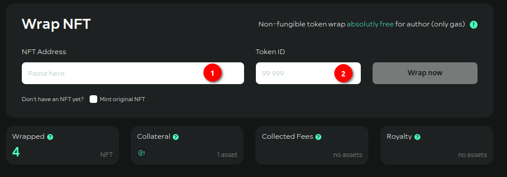
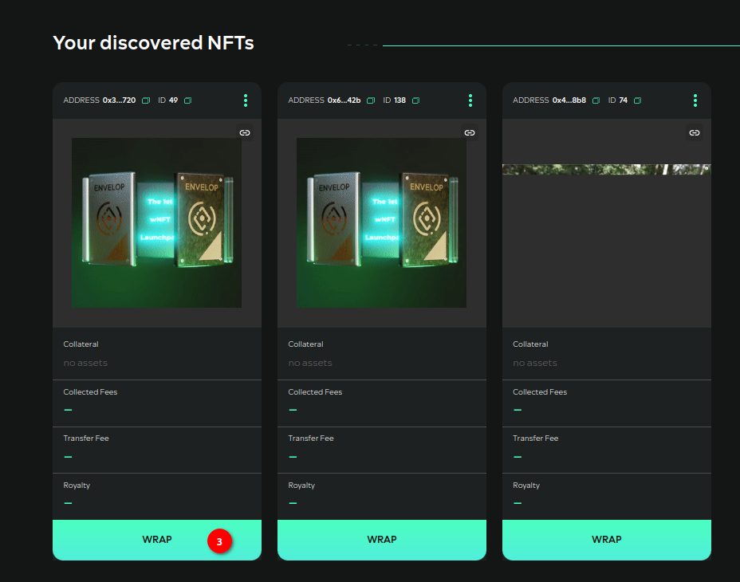
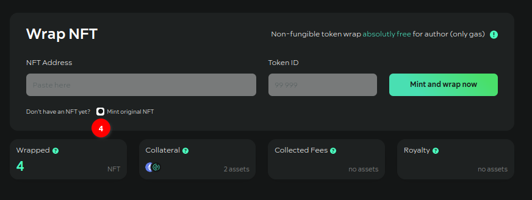
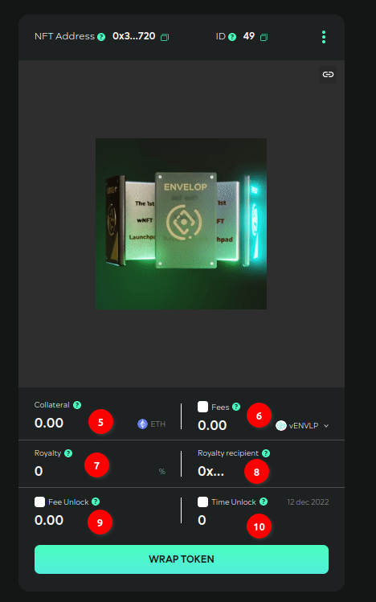
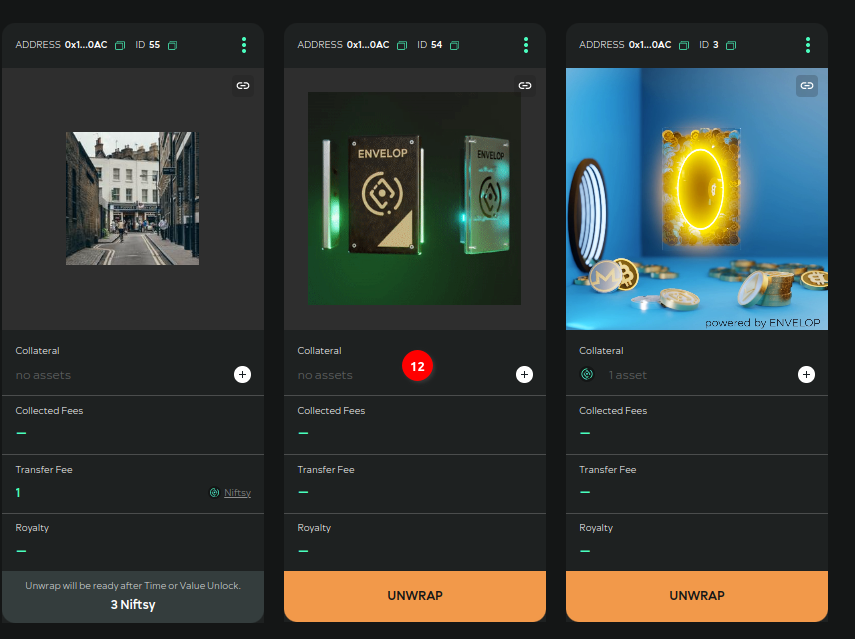
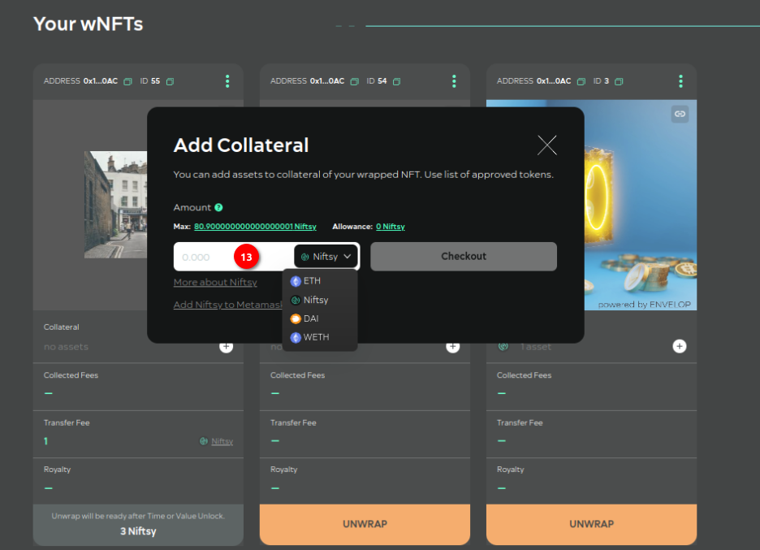
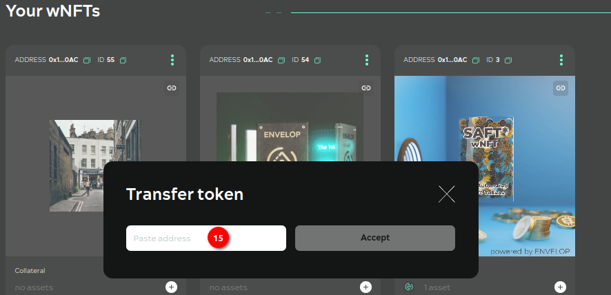
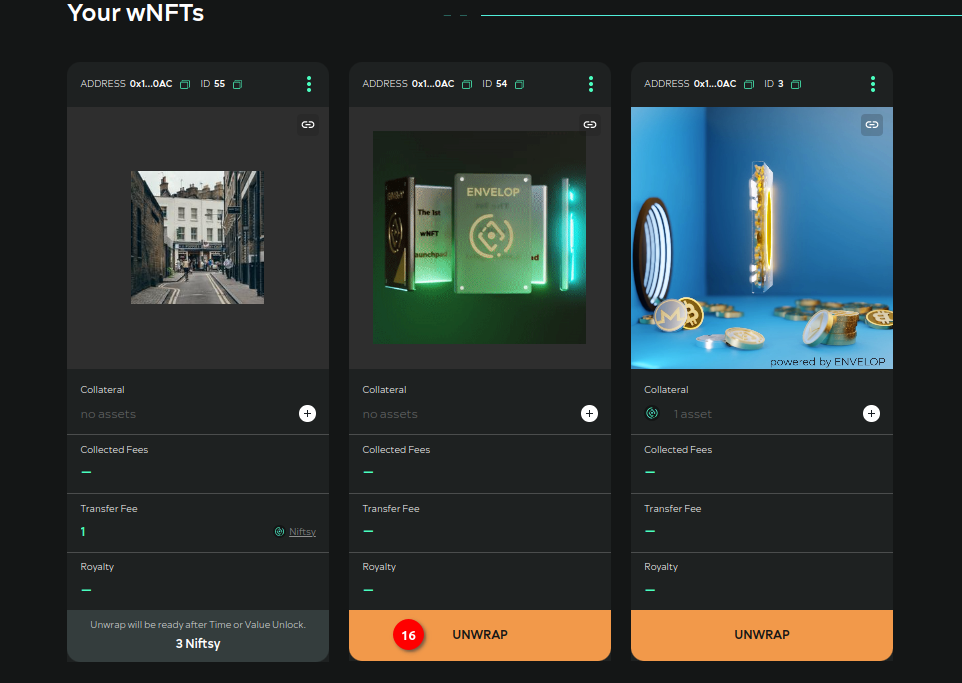
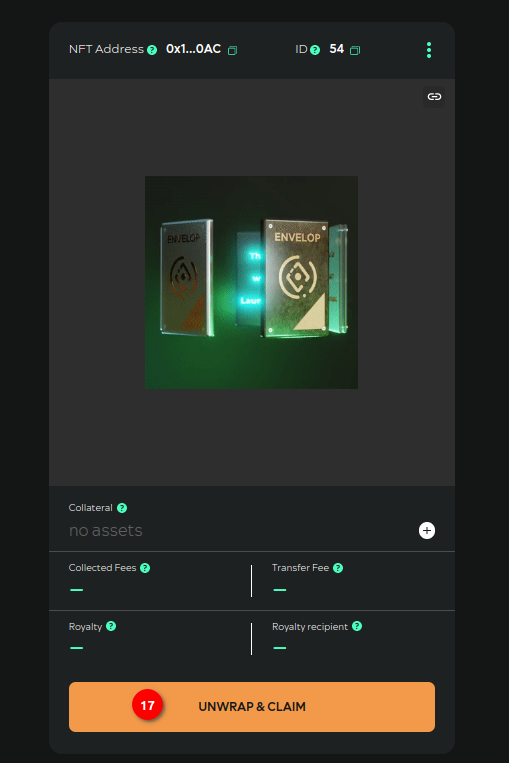

# Instruction

<figure><figcaption></figcaption></figure>

**Step №01**. Specify the smart-contract address of your original NFT (ERC-721) which you want to wrap.

**Step №02**. Specify the tokenID of the original NFT. Press the "WRAP" button.

<figure><figcaption></figcaption></figure>

**Step №03**. Either under "Your discovered NFTs" find the desired NFT (the section displays all ERC-721 standard NFTs you own) and press “WRAP”.&#x20;

<figure><figcaption></figcaption></figure>

**Step №04**. If you don't have the original NFT, you can mint it on the Envelop contract by enabling the "Mint original NFT'' checkbox. A "Mint and wrap Now" button will appear in the interface. Once it is clicked, you will need to confirm the minting transaction in MetaMask.\

<figure><figcaption></figcaption></figure>

**Step №05**. If you want to add Сollateral in the form of (native) network tokens when wrapping in wNFT, specify the number of tokens.

**Step №06**. If you want to set a fee to be paid on each transfer in ERC-20 tokens, select a token from the list and specify the amount. Note! Tokens are from the white-list of the Protocol only.

**Step №07**. If you want some third-party address to receive part of the commission, specify the % to be applied to the specified number of commission tokens and send to the Royalty income recipient. The remaining part of the commission will be **accumulated** in wNFT.&#x20;

**Step №08**. Give the address of the recipient of the Royalty income, if you have specified a value in the Royalty field.

**Step №09**. If you want wNFT not to be able to unWrap until wNFT has accumulated sufficient Transfer fees internally, specify a value for this **threshold** in the “Fee Unlock” field.

**Step №10**. If you want wNFT to be unlocked for some time, specify the number of days in the "Time Unlock" field. After entering the data, press "Wrap token" button. Confirm all transactions in MetaMask.&#x20;

<figure><figcaption></figcaption></figure>

**Step №11**. After confirmation, refresh the page. Under "Your wNFTs" your ERC-721 standard token will appear (version 0 only creates ERC-721 standard wNFTs). In the context menu for each wNFT you can find 3 items:

* copy the link to wNFT of the following form: https://app.envelop.is/#/token?chain=5\&contractAddress=0x12892c9c15aDdb41656a23f6eD758F8CbcC210AC\&tokenId=54&#x20;
* transfer wNFT to another user;
* allow a third-party address to manage all of your wNFTs of a given Protocol contract.

<figure><figcaption></figcaption></figure>

**Step №12**. Each wNFT has an "Add Collateral" button.&#x20;

<figure><figcaption></figcaption></figure>

**Step №13**. Select a token from the list and specify a quantity. Tokens - only from the white-list of the Protocol. Confirm transactions in MetaMask.\

<figure><figcaption></figcaption></figure>

**Step №14**. To transfer wNFT with a Transfer fee, select the appropriate menu item at wNFT.

<figure><figcaption></figcaption></figure>

**Step №15**. Specify recipient address wNFT. Confirm the transactions in MetaMask.

<figure><figcaption></figcaption></figure>

**Step №16**. To unwrap wNFT, press the button on wNFT itself.

<figure><figcaption></figcaption></figure>

**Step №17**. Confirm your action on the wNFT view page that opens. Confirm the transaction in the metamask. After unwrapping wNFT the original NFT, collateral tokens, fee tokens accumulated in wNFT will be sent to you.\
\
