# Instruction

### **Launch**

Address: [https://appv1.envelop.is/](https://appv1.envelop.is/)

Launch the app, connect your wallet. Use Metamask or Walletconnect

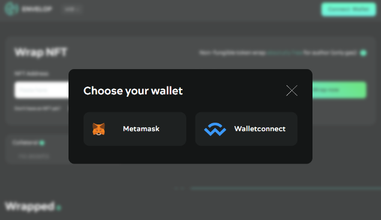

You can choose network

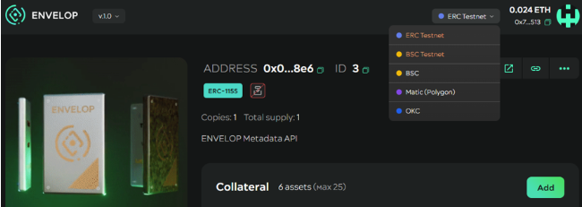

### Wrap wNFT

You can choose one of the options:

* specify the contract address of your token and ID
* or mint original NFT and create wNFT
* or wrap emptiness

Additionally you can choose:

* wNFT standard
* advanced options

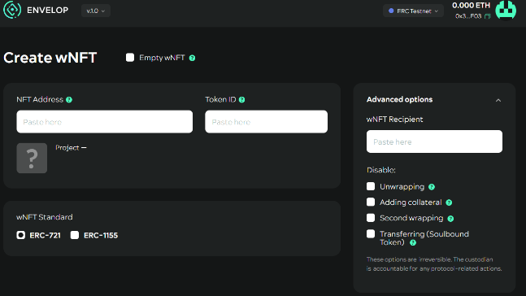

* add collateral

* specify the amount of the fee
* specify royalty income recipients
* specify unlock options

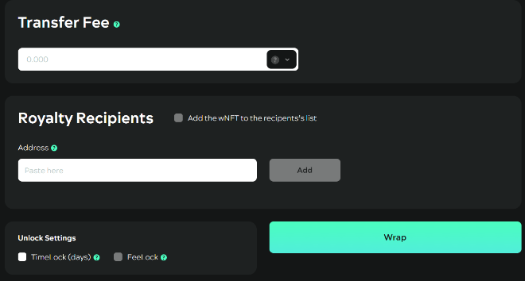

### Dashboard functionality

On your dashboard, you can see:

* all your NFT collateral
* original (discovered) and wrapped NFTs

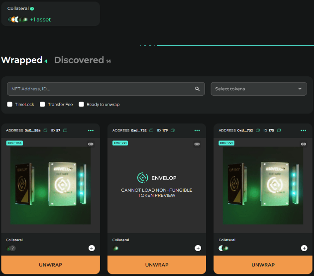

You can:

* copy wNFT URL
* set approval for all tokens of contract

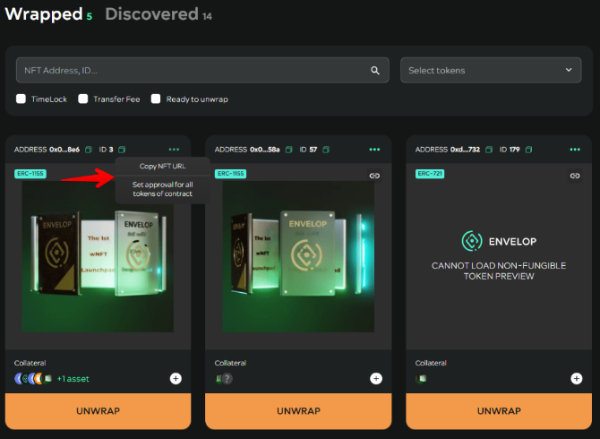

### Functionality of the wrapped nft viewing page

You can view everything inside the token (click at wrapped nft):

* royalty and fee settings
* lock settings
* information about the original token
* information about the collateral

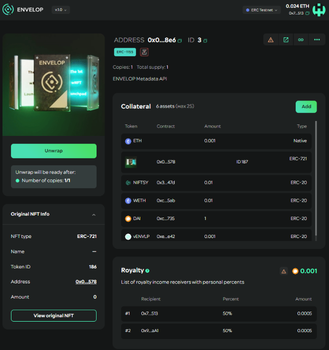

You can:&#x20;

* add more collateral

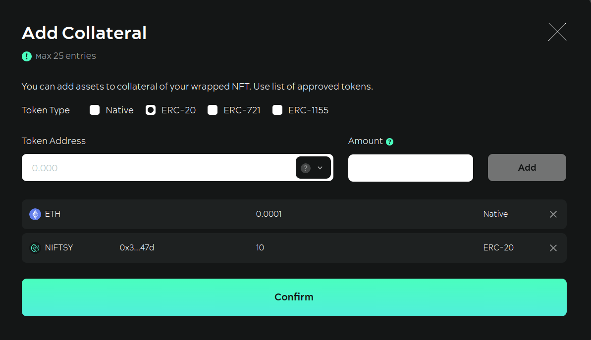

* unwrap if all constraint conditions are met
* send your tokens

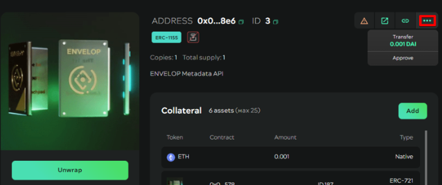

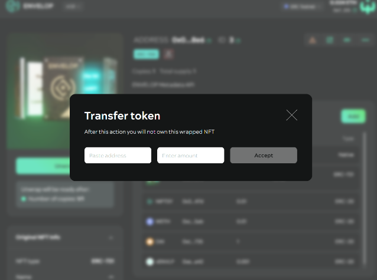

* set approval for token

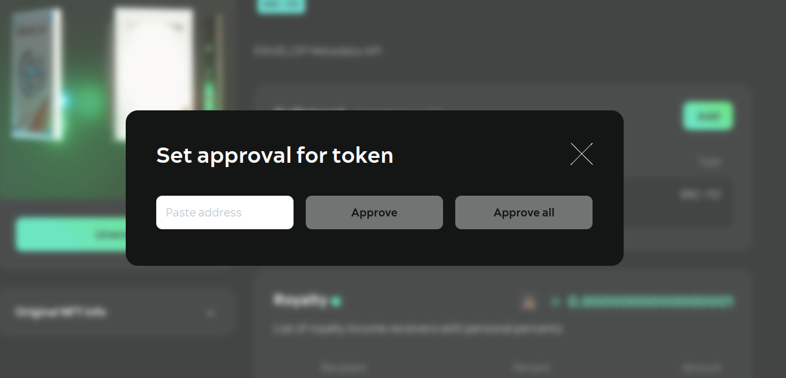
