# Instruction

### **Launch**

Address: [https://app.envelop.is/dashboard](https://app.envelop.is/dashboard)

Launch the app, connect your wallet. Use Metamask or other available wallet.

<figure>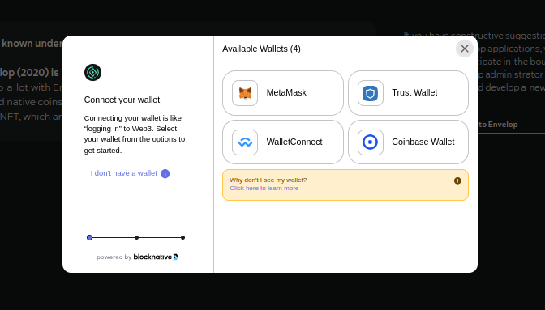<figcaption></figcaption></figure>

You can choose network

<figure>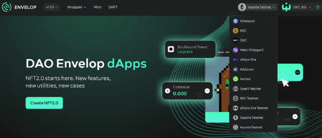<figcaption></figcaption></figure>

### Wrap wNFT

There are two modes to wrap wNFT: simple and advanced. The simple mode is being used for the fast wrapping: minimum number of settings, the wrapping of empty with a collateral and the time lock.&#x20;

<figure>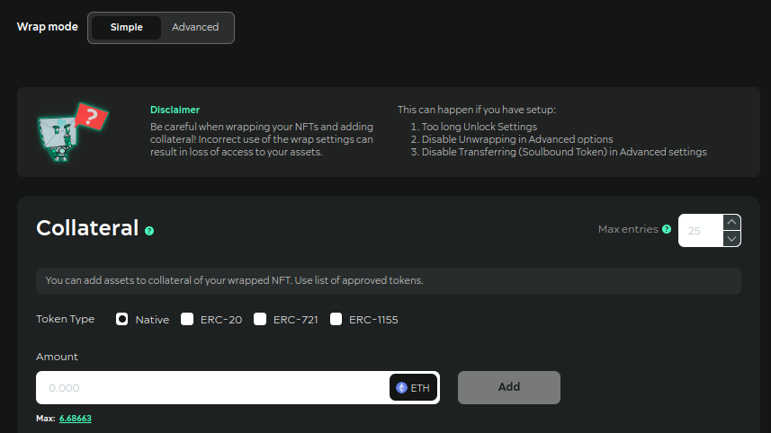<figcaption></figcaption></figure>

The advanced mode has full list of settings available for the wrapping.

<figure><figcaption></figcaption></figure>

You can choose one of the options:

* specify the contract address of your token and ID
* or mint NFT with Envelop metadata and create wNFT with it inside
* or wrap wNFT without NFT inside

<figure>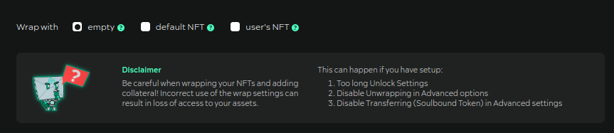<figcaption></figcaption></figure>

Additionally you can choose:

* wNFT standard
* advanced options

<figure>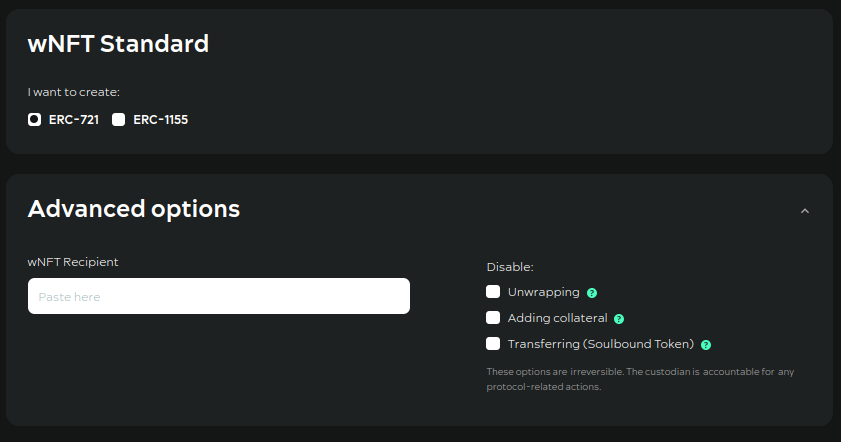<figcaption></figcaption></figure>

* add collateral

<figure>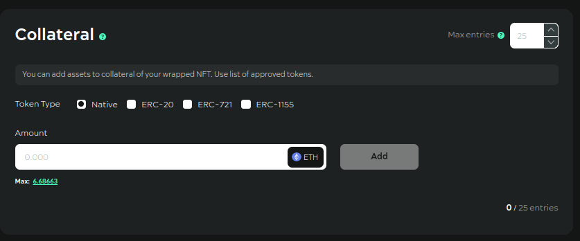<figcaption></figcaption></figure>

* specify the amount of the fee
* specify royalty income recipients
* specify unlock options

<figure>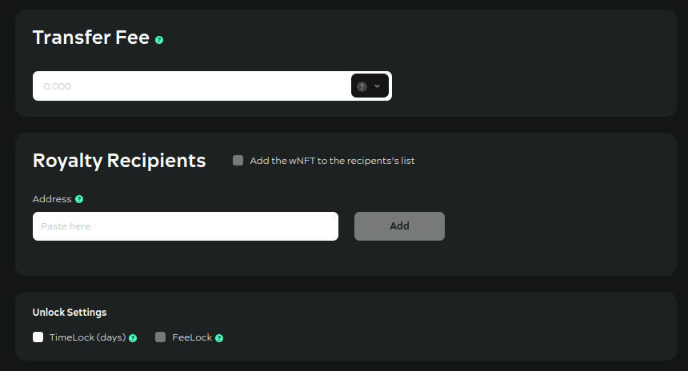<figcaption></figcaption></figure>

### Dashboard functionality

On your dashboard, you can see:

* all your wNFT collateral

<figure>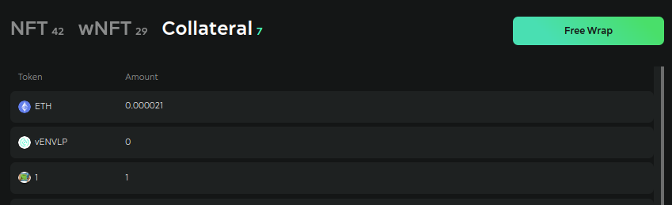<figcaption></figcaption></figure>

* NFTs and wrapped NFTs

<figure>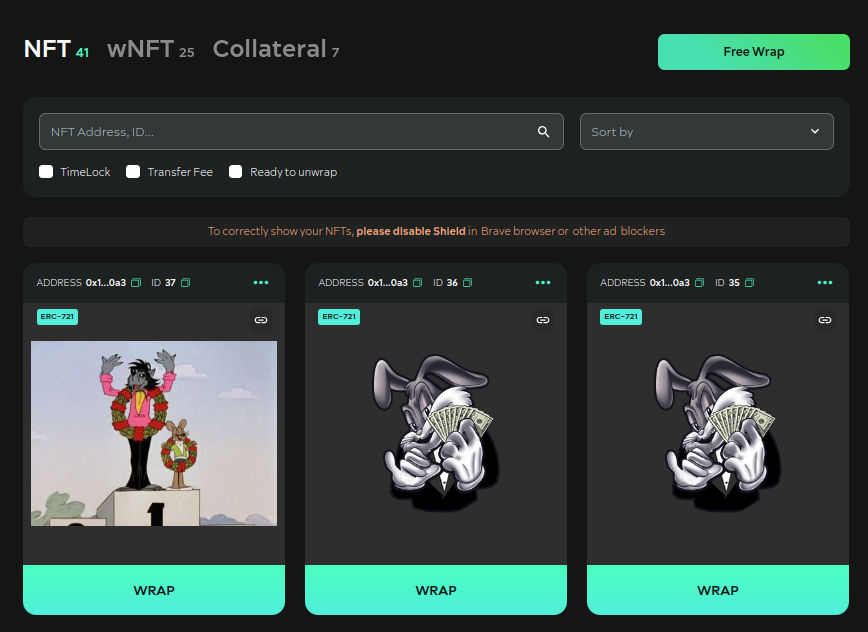<figcaption></figcaption></figure>

You can:

* copy wNFT URL
* set approval for all tokens of contract
* transfer NFT and wNFT

<figure><figcaption></figcaption></figure>

### Functionality of the wrapped nft viewing page

You can view everything inside the token (click at wrapped nft):

* royalty and fee settings
* lock settings
* information about the original token
* information about the collateral
* information about creation of wNFT

<figure>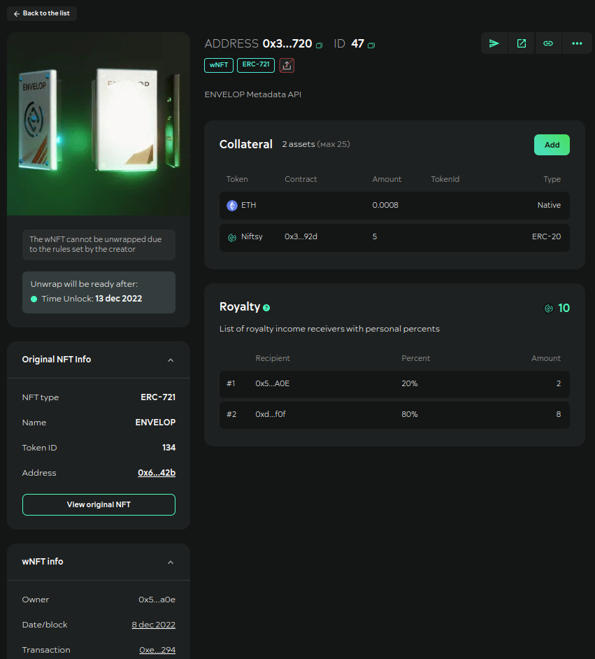<figcaption></figcaption></figure>

You can:&#x20;

* add more collateral

<figure>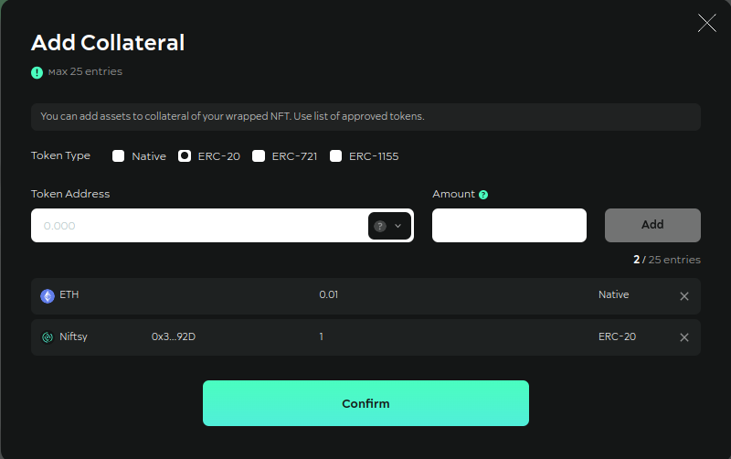<figcaption></figcaption></figure>

* unwrap if all constraint conditions are met
* send your tokens

<figure>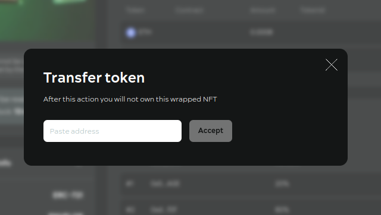<figcaption></figcaption></figure>

* set approval for token

<figure>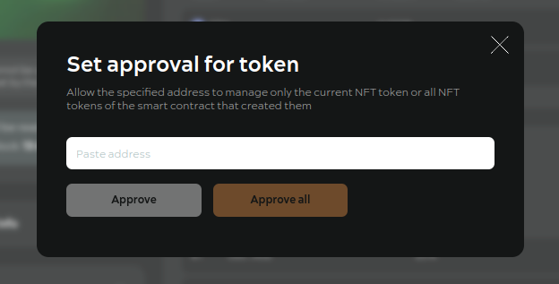<figcaption></figcaption></figure>

* request token metadata update (if it needs)

<figure>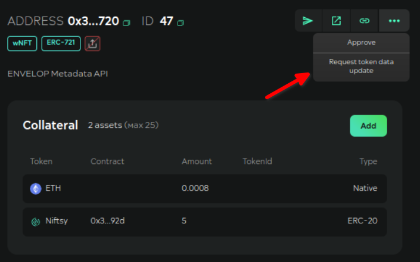<figcaption></figcaption></figure>
