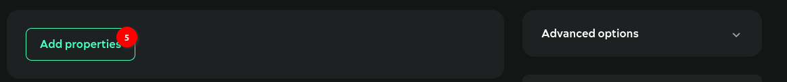
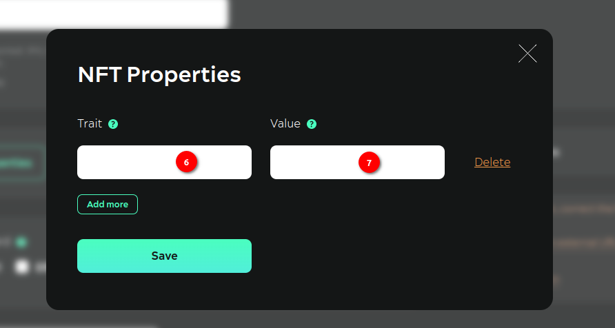
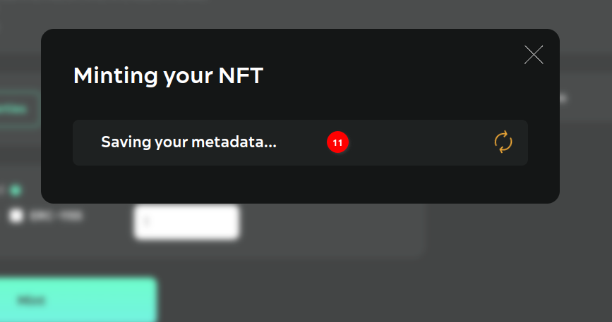
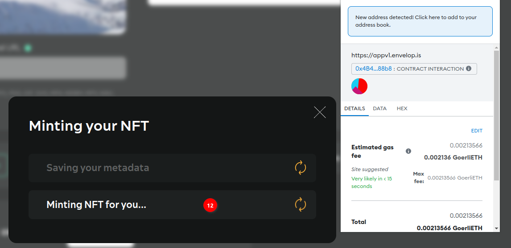
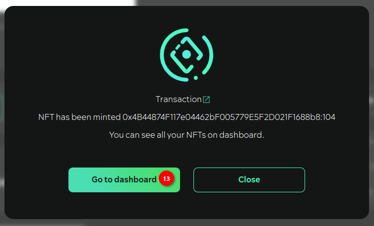

# Instruction

dApp for mint can be found at [https://appv1.envelop.is/mint/](https://appv1.envelop.is/mint/)&#x20;

<figure><figcaption></figcaption></figure>

**Step №01.** Download the media-file either by dragging and dropping it into the download area or via an explorer window

**Step №02.** Or provide an http link to the media-file. Important: The web storage of the media file should allow the media file to be displayed in third-party applications

**Step №03.** Enter Name

**Step №04.** Enter Description

<figure><figcaption></figcaption></figure>

**Step №05.** You can enter additional properties to be stored in the metadata

<figure><figcaption></figcaption></figure>

**Step №06.** Enter the name of the property

**Step №07.** Enter the meaning of the property

<figure><figcaption></figcaption></figure>

**Step №08.** Choose which standard you want the NFT to be minted to

**Step №09.** Specify the number of tokens to be minted per transaction

<figure><figcaption></figcaption></figure>

**Step №10.** If you have chosen to mint ERC-1155 tokens, enter the number of copies for each token to be minted

<figure><figcaption></figcaption></figure>

**Step №11.** Press Mint. First the metadata is saved in SWARM

<figure><figcaption></figcaption></figure>

**Step №12.** Then confirm the transaction in MetaMask

<figure><figcaption></figcaption></figure>

**Step №13.** After confirming the transaction, a message will be displayed allowing you to go to the main application ([https://appv1.envelop.is/list](https://appv1.envelop.is/list))  and view the NFTs created under “Discovered”\
