# Insctruction

<figure>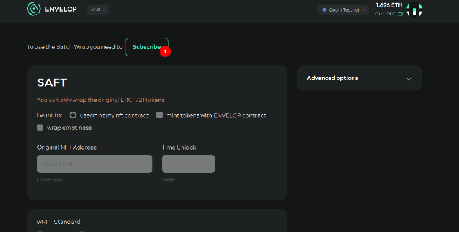<figcaption></figcaption></figure>

**Step №01.** Purchase (buy) a subscription:&#x20;

<figure>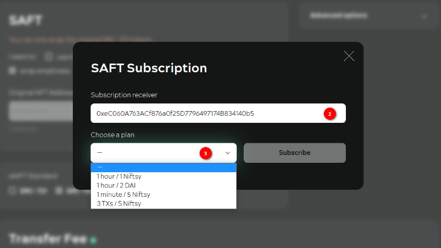<figcaption></figcaption></figure>

**Step №02**. Specify the recipient of the subscription (this can be a third party)

**Step №03**. Choose a subscription plan (now You need to have enough **NIFTSY** tokens in your wallet to purchase a subscription: these are added to wNFT with the time-lock that the subscription service creates for the user).\

<figure>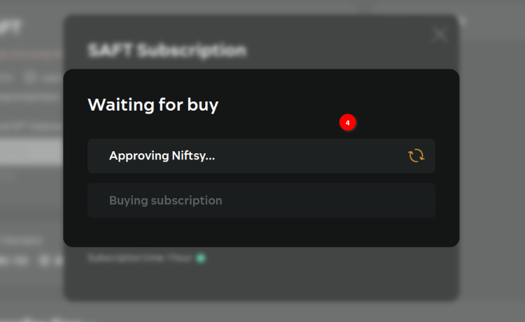<figcaption></figcaption></figure>

**Step №04**. Confirm all transactions in the MetaMask:

<figure>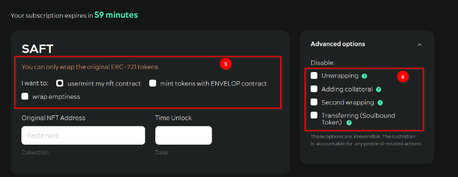<figcaption></figcaption></figure>

**Step №05**. Choose what to wrap around. Options:

* Original NFTs that are minted on a third-party contract (not from Envelop);
* Original NFTs that are minted on an Envelop contract;
* "Empty" (when creating wNFTs, the user does not transfer their original NFTs to the Envelop contract).

**Step №06**. Select restrictions on the behaviour of the created wNFTs. A combination of Disable “Unwrapping” and “Transferring” gives the ability to create a wNFT as a Soulbound Token (SBT).\

<figure><figcaption></figcaption></figure>

**Step №07**. If the original NFTs will be wrapped, select contract in the field (You have already had minted original NFTs):

<figure>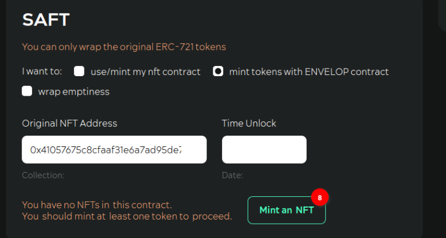<figcaption></figcaption></figure>

**Step №08**. In this case, you can **mint** yourself additional original NFTs in the Envelope app.

<figure>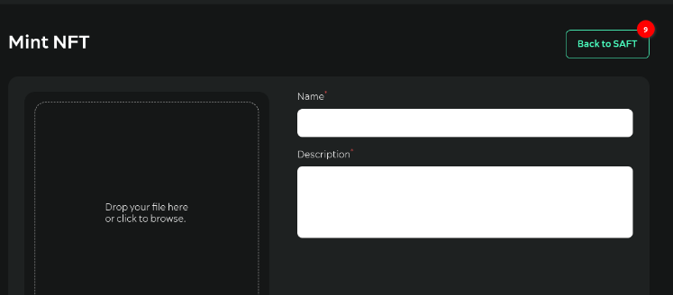<figcaption></figcaption></figure>

**Step №09**. After minting the original NFTs in the Envelop app You can go back to the SAFT (app page):\

<figure><figcaption></figcaption></figure>

**Step №10**. If the original NFTs of the third party contracts in the wrapper are used, either select the contract in the field or enter the contract address of the original NFTs.

<figure>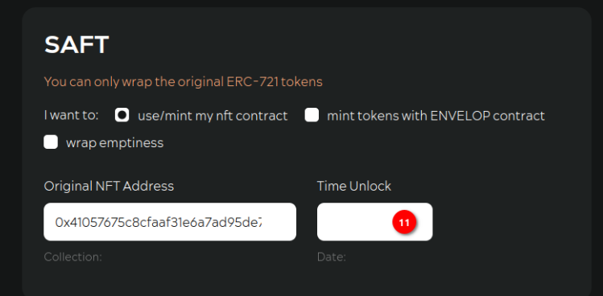<figcaption></figcaption></figure>

**Step №11**. Set time-lock value in days (if You want to create wNFT with time-lock after which You can deploy wNFT):\

<figure>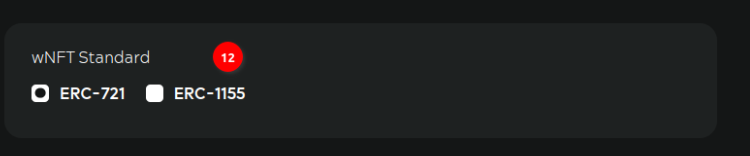<figcaption></figcaption></figure>

**Step №12**. Select which standard You want to create (mint) wNFT:&#x20;

<figure>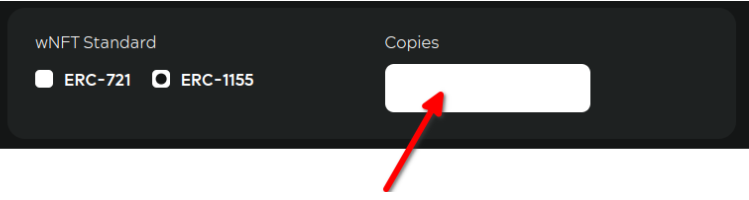<figcaption></figcaption></figure>

**Step №12.1**. If ERC-1155 is selected,specify the number of copies for each wNFT:

<figure>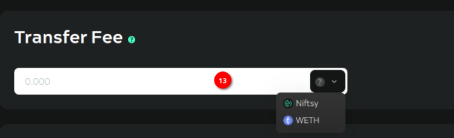<figcaption></figcaption></figure>

**Step №13**. If You want to make wNFT withholding fee each time a transfer is created by wNFT, then select a fee token and specify the amount of fee:\

<figure>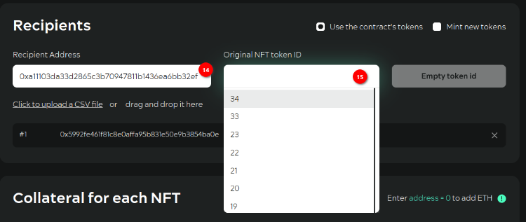<figcaption></figcaption></figure>

**Step №14**. Specify wNFT recipients. You can specify addresses manually in the field, You can load a list of addresses from csv-files. The format of the data in the file: strings consisting of recipient addresses and **tokenID** of the original NFTs to wrap for them. The data in the lines is separated by semicolons. If "**empty**" wrapping is selected, the tokenID does not need to be specified in the file.

**Step №15**. Enter the tokenID of the original contract token you specified above. If You click on the field, a list with all available original NFT contract tokens You own will open:

<figure>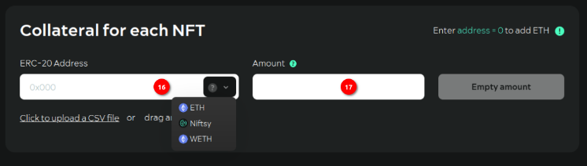<figcaption></figcaption></figure>

**Step №16**. If You want wNFT to have collateral, select a token from the list or enter the token's smart-contract address if it is not in the list.

**Step №17**. Specify the number of tokens to be added to each wNFT to be created:

<figure>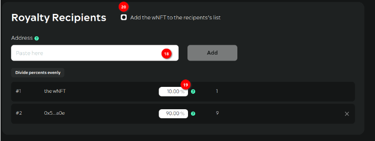<figcaption></figcaption></figure>

**Step №18**. If You have set up a fee for wNFT, specify the recipients of the royalty income by entering the addresses in the field.

**Step №19**. Specify the % to be deducted from the transfer fee for this recipient.&#x20;

**Step №20**. The recipient of royalty income can be wNFT itself. Revenue royalty tokens will be added to wNFT's collateral:

<figure>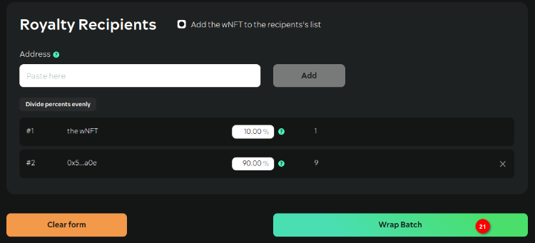<figcaption></figcaption></figure>

**Step №21**. Once You have filled in all the fields, click “Wrap Batch”:

<figure>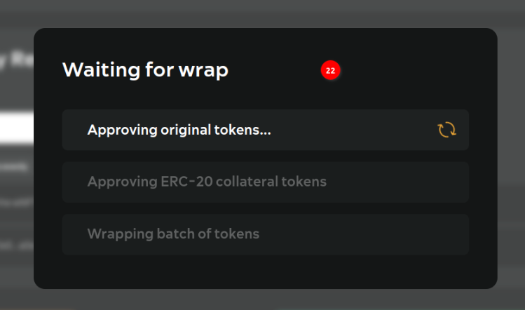<figcaption></figcaption></figure>

**Step №22**. Confirm all transactions.
