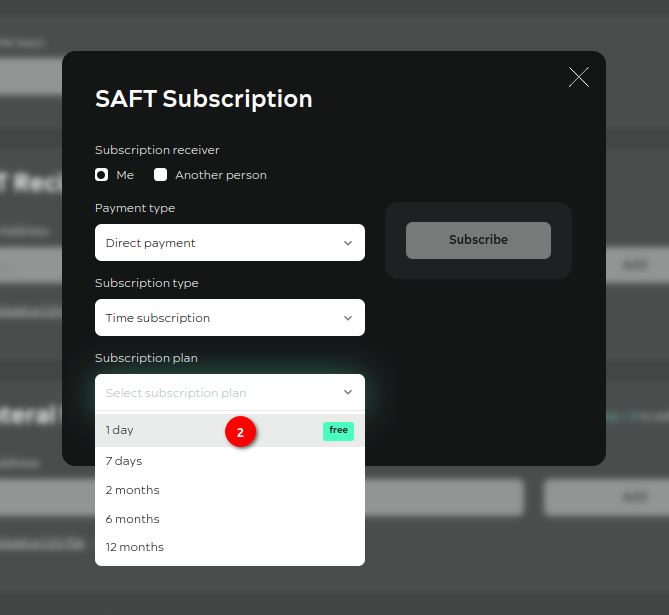
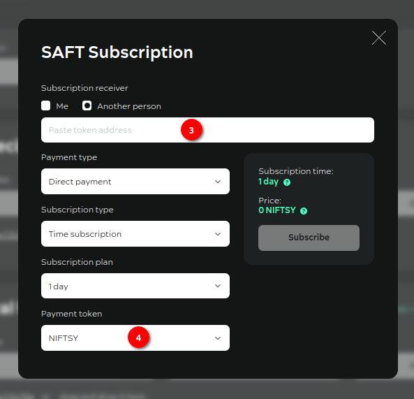
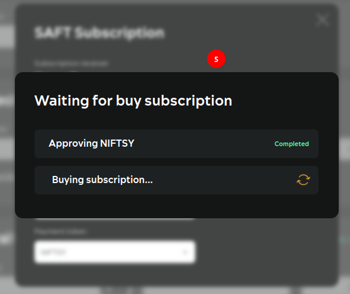
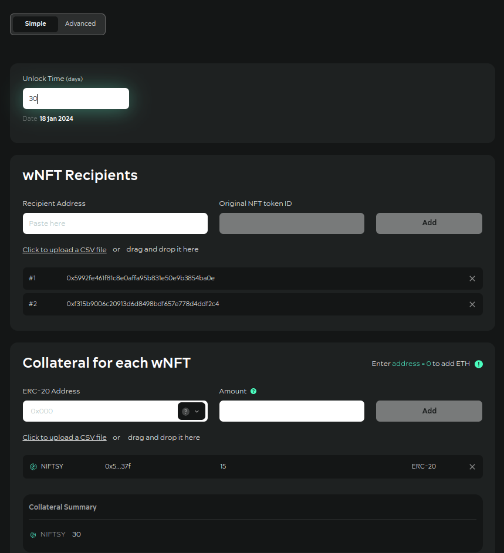
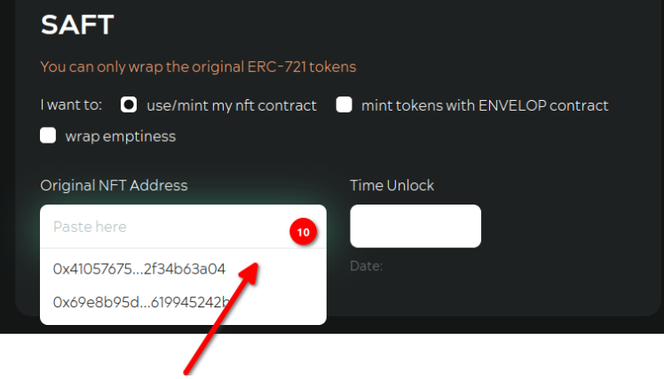

# Insctruction

This dAPP offers to you the possibilities to create the wNFT batches, the SBT batches, add collateral in wNFT batch per one transaction.

### How to create wNFT batch

<figure><figcaption></figcaption></figure>

**Step №01.** Purchase (buy) a subscription (if a subscription is switched on):&#x20;

<figure><figcaption></figcaption></figure>

**Step №02**. Specify the subscription parameters: the payment type, the subscription type, the subscription plan (Attention! There are free subscription plans. They have green labels "free" in the list).

There are two payment types - the direct payment and the token deposit. The token deposit way locks user's ERC20 tokens in wNFT with the time-lock for the buyer. The direct payment way charges fee for using the service in ERC20 or native tokens.

<figure><figcaption></figcaption></figure>

**Step №03**. Specify the subscription recipient

**Step №04**. Specify the payment token (User does not have to have the payments tokens on balance in free subscription plan case).

<figure><figcaption></figcaption></figure>

**Step №05**. Confirm all transactions in the MetaMask

**Step №06**. There are two modes of dApp's working: simple and advanced.&#x20;

<figure><figcaption></figcaption></figure>

The simple mode is being used for the fast wrapping: minimum number of settings, the wrapping of empty with a collateral and the time lock for recipients from the list.&#x20;

<figure><figcaption></figcaption></figure>

The advanced mode has full list of settings available for the wrapping.

<figure><figcaption></figcaption></figure>

**Step №07**. Choose what to wrap around. Options:

* Use/mint my nft contract - NFTs that are minted on a third-party contract (not from Envelop);
* Mint tokens with ENVELOP contract - NFTs that are minted on an Envelop contracts;
* Wrap emptiness - the user does not transfer their NFTs to the Envelop contract.

**Step №08**. Select restrictions on the behaviour of the created wNFTs. A combination of Disable “Unwrapping” and “Transferring” gives the ability to create a wNFT as a Soulbound Token (SBT).\

<figure><figcaption></figcaption></figure>

**Step №09**. If the original NFTs will be wrapped, select contract in the field (You have already had minted original NFTs):

<figure><figcaption></figcaption></figure>

**Step №10**. In this case, you can **mint** yourself additional original NFTs in the Envelope app.

<figure><figcaption></figcaption></figure>

**Step №11**. After minting the original NFTs in the Envelop app You can go back to the SAFT (app page):\

<figure><figcaption></figcaption></figure>

**Step №12**. If the original NFTs of the third party contracts in the wrapper are used, either select the contract in the field or enter the contract address of the original NFTs.

**Step №13**. Set time-lock value in days (if You want to create wNFT with time-lock after which You can deploy wNFT):\

<figure><figcaption></figcaption></figure>

**Step №14**. Select which standard You want to create (mint) wNFT:&#x20;

<figure><figcaption></figcaption></figure>

**Step №14.1**. If ERC-1155 is selected,specify the number of copies for each wNFT:

<figure><figcaption></figcaption></figure>

**Step №15**. If You want to make wNFT withholding fee each time a transfer is created by wNFT, then select a fee token and specify the amount of fee:

<figure><figcaption></figcaption></figure>

\
**Step №16**. Specify royalty Recipients if fee was set. All fee or only part of it can be accumulated in wNFT. If You have set up a fee for wNFT, specify the recipients of the royalty income by entering the addresses in the field. In this case specify the % to be deducted from the transfer fee for this recipients. The recipient of royalty income can be wNFT itself. Revenue royalty tokens will be added to wNFT's collateral (if user will switch on checkbox "Add the wNFT to the recipients list")

<figure><figcaption></figcaption></figure>

**Step №17**. Specify wNFT recipients. You can specify addresses manually in the field, You can load a list of addresses from csv-files. The format of the data in the file: strings consisting of recipient addresses and **tokenID** of the original NFTs to wrap for them. The data in the lines is separated by semicolons. If "**empty**" wrapping is selected, the tokenID does not need to be specified in the file.

**Step №18**. Enter the tokenID of the original contract token you specified above. If You click on the field, a list with all available original NFT contract tokens You own will open:

<figure><figcaption></figcaption></figure>

**Step №19**. If You want wNFT to have collateral, select a token from the list or enter the token's smart-contract address if it is not in the list.

<figure><figcaption></figcaption></figure>

**Step №20**. Once You have filled in all the fields, click “Wrap Batch”:

<figure><figcaption></figcaption></figure>

**Step №21**. Confirm all transactions.

### How to add the collateral in wNFT batch

The dAPP offers the possibility to add the collateral in multiple wNFTs in one transaction. The main condition for this action is that wNFTs should be created in this dAPP.

**Step №01.** Switch to Add Collateral tab

**Step** **№02.** Fill in the wNFT contract address and the token ID range like on the picture.

<figure><figcaption></figcaption></figure>

Or upload the csv data file in the following format:

0x0c9b826dba10268f1e64e5bb212242c6d9be864a;140; 0x0c9b826dba10268f1e64e5bb212242c6d9be864a;141; 0x0c9b826dba10268f1e64e5bb212242c6d9be864a;142;

**Step** **№03.** Press Add button.

**Step** **№04.** Add the collateral data: ERC-20 address of token smart contract and the token amount for one wNFT. The dAPP adds the same token  amount in every wNFT.&#x20;

<figure><figcaption></figcaption></figure>

Or upload the csv data file in the following format:

0x5dB9f4C9239345308614604e69258C0bba9b437f;10;

**Step** **№05.** Press Add button.

<figure><figcaption></figcaption></figure>

The data is ready.&#x20;

**Step** **№06.** Press Add Collateral button.

**Step №07.** Confirm all transactions in your wallet. After that the wNFTs will contain the added ERC-20 tokens in themselves. Great! It's done!
