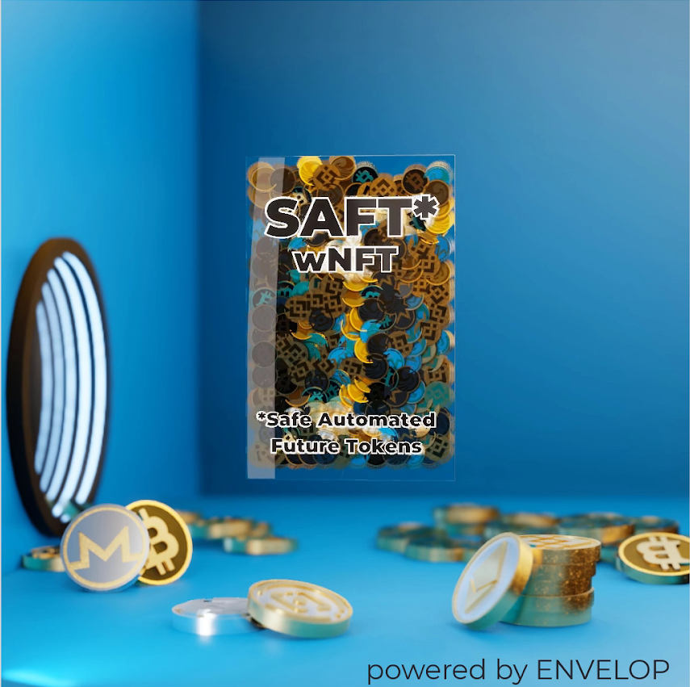

# How to make SAFT wNFT

#### Subscription workflow and conditions

1. Supported chain for SAFT wNFT: Ethereum, BNB Smart Chain, Polygon
2. Anyone is able to use SAFT wNFT: project or VC representative, OTC dealer, KOL, common user and etc.
3. To proceed the subscription 200’000 NIFTSY tokens are required to be held on the your wallet by which user will form SAFT wNFTs.
4. The subscription involves wrapping and send back to the user wNFT with 200’000 NIFTSY with time lock on 12 month and subscription period 1 month.
5. Only owner/wrapper of wNFT (with 200’000 NIFTSY tokens inside) will be able to make wrapping.
6. After subscription done the user will be able to wrap ANY ERC/BEP-20 tokens from his wallet with vesting periods (time-locks). Also, multi-collateral formation is available — the user can form his unique secured index.
7. The owner is free to choose: hodl wNFT for 12 months and then unwrap it to get NIFTSY tokens back or to sell it on any NFT marketplace including SCOTCH (special wNFT marketplace) or to distribute it via any OTC deal.


**We are constantly working to improve the user interface of the dApp, so the screenshots may be a bit different from what you see in your browser**


\
**Requirements:**&#x20;

1. You will need a Metamask or a Walletconnect
2. To set up a Metamask Wallet for different chains, please follow our instructions [https://docs.envelop.is/tutorials/metamask-settings-for-different-networks](https://docs.envelop.is/tutorials/metamask-settings-for-different-networks)
3. 200 000 NIFTSY with time lock for 12 months to get SAFT access for 1 month .

#### Step-by-step

1\. Go to the [https://app.envelop.is/#/saft](https://app.envelop.is/#/saft) address. Choose your chain. Now dApp supports Ethereum, BNB Chain, Polygon.

2\. Click the button “Connect wallet”

\
3\. Choose your wallet

4\. I will show how the dApp works using the Metamask wallet as an example, but you can use Walletconnect

5\. Click “Subscribe for 1 mounth” button

\
6\. On the mainnet you should have Wrap 200000 NIFTSY with time lock for 30 days to get SAFT access for 1 month.&#x20;

7\. Click on the button “Approve and checkout”

\
8\. Confirm your NIFTSY spend transaction in Metamask

9\. Confirm your Buy Ticket transaction in Metamask

10\. Click on the button “Ok”

11\. After that we can make our wrapped NFT. Firstly, let’s make empty wNFT without original NFT inside and with 1 day timelock. Set 1 or more recipient addresses (it could be any address on the chain where you wrap, but we use same address for example). A guideline for the number to wrap at a time:

* BSC network - 50-70 wNFT;
* Polygon network - 40 wNFT.

After that we set 0.01 Eth as collateral for each wNFT. The amount of the collateral in native coins will be divided automatically among all the recipients. But if you put ERC20 tokens in the collateral, they are added to each recipient in the specified amount.

The recipient list and tokenId of the original NFTs can be uploaded from a csv file.

\
\
\
The file specifies the destination address and tokenId, separated by semicolons. If the wrapping of an empty is intended, the tokenId does not need to be specified.

The list of collateral tokens can be uploaded from a csv file.

The file specifies the token address and quantity, separated by semicolons. If a user wants to add native tokens for created wNFTs, the user has to specify zero address and total number of native tokens (which will be divided among all wNFTs). The fractional part of the number is separated by a dot. If the user wants to add ERC20 tokens for the created wNFTs, they need to specify the contact address of the token and the number of ERC20 tokens to be added to each created wNFT. The quantity is specified in integers only.

\
12\. Press the “Wrap” button and confirm the transaction in Metamask. If you set collateral, you will need to approve the transaction for each asset.

\
13\. Your NFT will be wrap with default wNFT metadata, if you do not use your NFT

14\. You can see your wNFT here [https://app.envelop.is/#/list](https://app.envelop.is/#/list)&#x20;

15\. You can trade your wNFT on OTC marketplace https://scotch.sale
