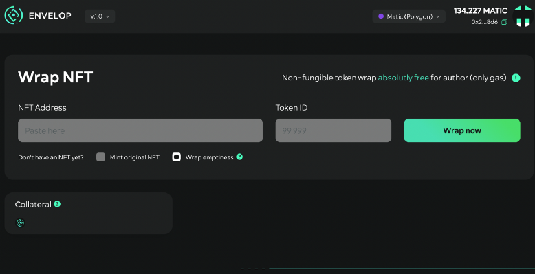
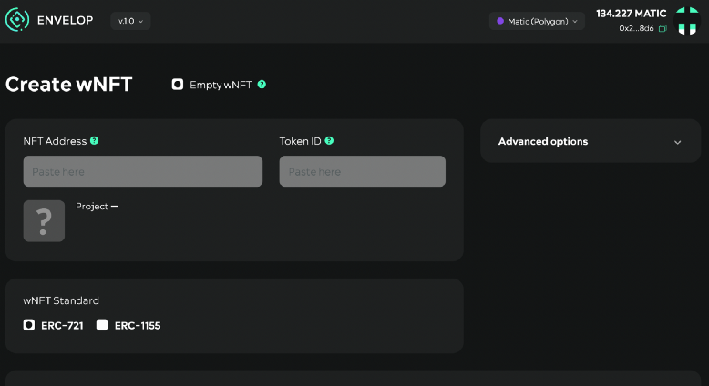
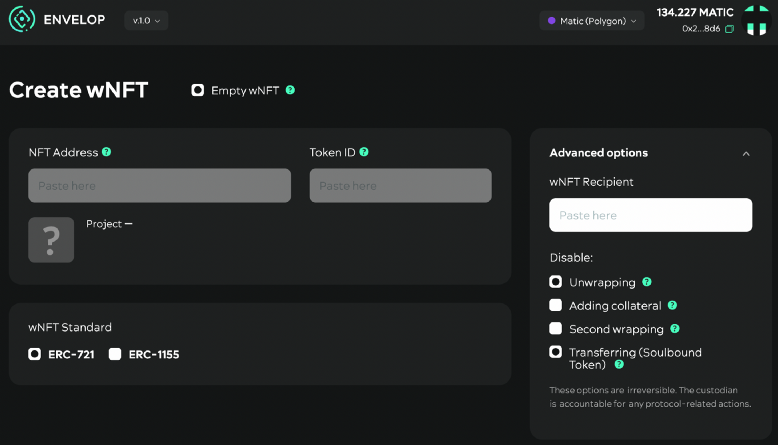
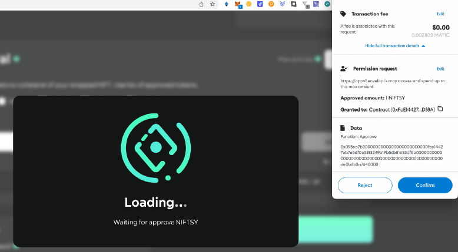
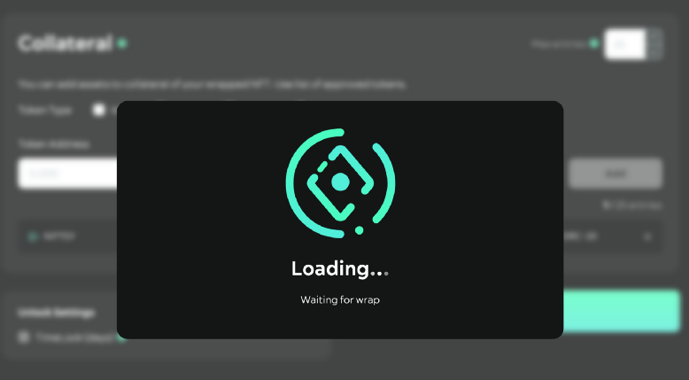
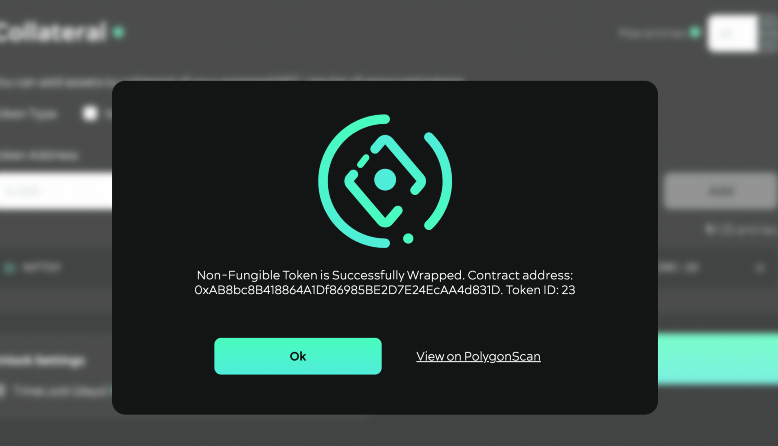
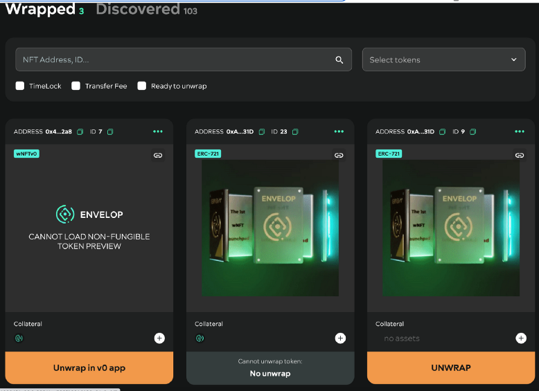
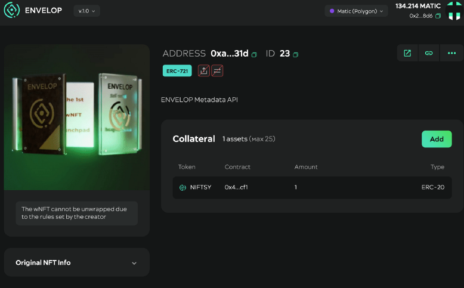

# How to mint Soulbound tokens with Envelop

So, to create your first SBT without code you can use DAO ENVELOP dApp: [https://appv1.envelop.is/list](https://appv1.envelop.is/list)

Connect to the dapp via Metamask wallet. Check “Wrap emptiness” and click “Wrap now”

<figure><figcaption>
How to mint Soulbound tokens with ENVELOP
</figcaption></figure>

After that you’ll redirect to the page: [https://appv1.envelop.is/wrap?empty=true](https://appv1.envelop.is/wrap?empty=true)

<figure><figcaption>
How to mint SBT with ENVELOP
</figcaption></figure>

Click on the “Advanced options” menu, and select “Unwrapping” to prevent the owner from unwrapping wNFT in the future, and “Transferring”, which sets the token’s untransferability condition. Which is the key feature of the Soulbound Token.

<figure><figcaption>
How to mint Soulbound tokens with ENVELOP
</figcaption></figure>

You can immediately add some fungible or not fungible token to the Collateral, if you want the SBT to have the right feature at the mint time, but you can do it later.

Next you need to confirm the transaction in the wallet.

<figure><figcaption></figcaption></figure>

After that, wait for the wrap:

<figure><figcaption></figcaption></figure>

That’s how, in just a few clicks, you minted an SBT. See our example [https://polygonscan.com//tx/0x86d10fba3f57fc5831f2d641415a8c687ac6e6a2bdf9d122373b316361793bab](https://polygonscan.com/tx/0x86d10fba3f57fc5831f2d641415a8c687ac6e6a2bdf9d122373b316361793bab)

<figure><figcaption></figcaption></figure>

You can find your SBT here [https://appv1.envelop.is/list](https://appv1.envelop.is/list)

<figure><figcaption></figcaption></figure>

And there is a specific page for SBT. In our case it is: [https://appv1.envelop.is/token/137/0xAB8bc8B418864A1Df86985BE2D7E24EcAA4d831D/23](https://appv1.envelop.is/token/137/0xAB8bc8B418864A1Df86985BE2D7E24EcAA4d831D/23) (where 137 is the Polygon chain ID):

<figure><figcaption></figcaption></figure>

Under the address you see the ERC type of token and its properties, that it is non-transferable and non-unwrappable.


You can contact DAO ENVELOP to add your tokens to the whitelist, or you can deploy a specific smart contract with similar functionality. To do this — write to the contacts on the main page [info@envelop.is](mailto:info@envelop.is). Next time I will tell you about SBT usecases.

